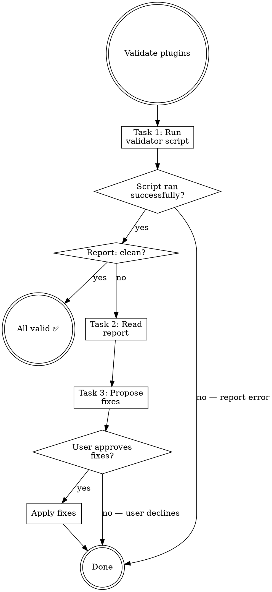

# Validating Plugins

## Overview

Runs batch structural validation across all plugin components, writes a report, then proposes fixes.

**Core principle:** Validation should be cheap to run and easy to act on. The report is the source of truth — read it fully before proposing any fixes.

## Routing

**Pattern:** Skill Steps
**Handoff:** none
**Next:** none

## Task Initialization (MANDATORY)

Before ANY action, create task list using TaskCreate:

```
TaskCreate for EACH task below:
- Subject: "[validating-plugins] Task N: <action>"
- ActiveForm: "<doing action>"
```

**Tasks:**
1. Run validator script
2. Read report
3. Propose fixes

Announce: "Created 3 tasks. Starting execution..."

**Execution rules:**
1. `TaskUpdate status="in_progress"` BEFORE starting each task
2. `TaskUpdate status="completed"` ONLY after verification passes
3. NEVER skip to next task until current is completed

## Task 1: Run Validator Script

**Goal:** Execute `validate_all.py` and capture the report path.

```bash
{ command -v uv >/dev/null 2>&1 && uv run "${CLAUDE_SKILL_DIR}/../../hooks/validate_all.py"; } \
  || { python3 --version >/dev/null 2>&1 && python3 "${CLAUDE_SKILL_DIR}/../../hooks/validate_all.py"; } \
  || python "${CLAUDE_SKILL_DIR}/../../hooks/validate_all.py"
```

Parse stdout for:
- `report:<path>` — path to the generated Markdown report
- `issues:<N> files, <M> warnings` — summary if issues exist
- `status:clean` — no issues

**If script fails to run:** Check that `validate_all.py` exists at `plugins/rcc/hooks/validate_all.py`. If missing, stop and report.

**Verification:** Script ran, report path captured.

## Task 2: Read Report

**Goal:** Read the full validation report and understand all issues.

Read the file at the report path captured in Task 1.

For each issue entry, note:
- File path
- Warning type: `extra frontmatter field` / `broken link` / `orphaned file` / `invalid variable` / `plugin validate`
- Specific value flagged

**If no issues (`status:clean`):** Report to user that everything is valid and mark all tasks complete.

**Verification:** All issues catalogued.

## Task 3: Propose Fixes

**Goal:** For each issue, propose a concrete fix. Group by file.

**Fix patterns:**

| Warning type | Fix |
|---|---|
| `extra frontmatter field: "X"` | Remove field `X` from frontmatter (or rename if it's a valid field with wrong name) |
| `broken link: path/to/file.md` | Either create the missing file, or remove the dead link from SKILL.md |
| `orphaned file: path/to/file.md` | Either add a markdown link to SKILL.md, or delete the file if unused |
| `invalid variable: ${CLAUDE_PLUGIN_ROOT}` | Replace with `${CLAUDE_SKILL_DIR}/../../` pattern, or move the reference to hooks/hooks.json |
| `plugin validate: <error>` | Fix the specific manifest error reported |

Present fixes grouped by file. For each file, show the exact edit needed (old → new).

Ask user to confirm before applying any fixes.

**Verification:** User has reviewed and approved (or rejected) proposed fixes.

## Red Flags - STOP

- "Skip reading the full report" — every issue needs to be seen
- "Fix issues without user approval" — always confirm before editing
- "Guess what the fix should be" — derive from the warning type table above
- "Run the script without capturing report path" — the path is needed for Task 2

## Common Rationalizations

| Excuse | Reality |
|--------|---------|
| "The validator already ran clean" | Validator checks structure, not content quality. Manual review catches semantic issues. |
| "It's just frontmatter" | Wrong frontmatter means skills don't trigger, agents get wrong tools, hooks don't fire. |
| "I'll fix it later" | Invalid plugin files silently degrade. Fix now or users hit confusing errors. |
| "Only one file has issues" | One broken link or orphaned file signals systemic neglect. Check everything. |

## Flowchart


