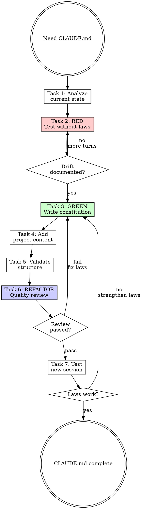

# Writing CLAUDE.md

## Overview

**Writing CLAUDE.md IS establishing a constitution for your project.**

The `<law>` block mechanism forces Claude to actively repeat constraints each response, preventing context drift over long conversations.

**Core principle:** Laws without Self-Reinforcing Display drift out of context. The display IS the enforcement.

**Violating the letter of the rules is violating the spirit of the rules.**

## Task Initialization (MANDATORY)

Before ANY action, create task list using TaskCreate:

```
TaskCreate for EACH task below:
- Subject: "[writing-claude-md] Task N: <action>"
- ActiveForm: "<doing action>"
```

**Tasks:**
1. Analyze current state
2. RED - Test without proper laws
3. GREEN - Write constitution
4. Add project content
5. Validate structure
6. REFACTOR - Quality review
7. Test with new session

Announce: "Created 7 tasks. Starting execution..."

**Execution rules:**
1. `TaskUpdate status="in_progress"` BEFORE starting each task
2. `TaskUpdate status="completed"` ONLY after verification passes
3. If task fails → stay in_progress, diagnose, retry
4. NEVER skip to next task until current is completed
5. At end, `TaskList` to confirm all completed

## TDD Mapping for CLAUDE.md

| TDD Phase | CLAUDE.md Creation | What You Do |
|-----------|-------------------|-------------|
| **RED** | Test without laws | Observe agent without proper `<law>` block |
| **Verify RED** | Document drift | Note where agent forgot constraints |
| **GREEN** | Write constitution | Create `<law>` block addressing drift |
| **Verify GREEN** | Test enforcement | Verify laws displayed every response |
| **REFACTOR** | Improve laws | Make laws more specific, verifiable |

## Task 1: Analyze Current State

**Goal:** Understand what exists and what's needed.

**If CLAUDE.md exists:**
1. Read current content
2. Check for `<law>` blocks
3. Identify missing or weak laws
4. Note project structure accuracy

**If no CLAUDE.md:** Document project basics (name, purpose, key paths).

**Verification:** Can list what laws are needed and why.

## Task 2: RED - Test Without Proper Laws

**Goal:** Observe agent behavior without proper `<law>` enforcement.

**Process:**
1. Start session with weak/no CLAUDE.md
2. Have multi-turn conversation (5+ turns)
3. Observe where constraints are forgotten
4. Document specific drift instances

**Verification:** Documented at least 2 instances where agent forgot constraints.

### What Drift Looks Like

```
Turn 1: Agent follows communication guidelines
Turn 3: Agent starts adding unnecessary explanations
Turn 5: Agent forgets project-specific conventions
Turn 8: Agent ignores stated preferences entirely
```

**This is why Self-Reinforcing Display matters.**

## Task 3: GREEN - Write Constitution

**Goal:** Create `<law>` block that prevents the drift you documented.

### CLAUDE.md Structure

```markdown
# Project Name

One-line description.

## Immutable Laws

<law>
**CRITICAL: Display this block at start of EVERY response.**

**Law 1: [Name]** - [Specific, verifiable constraint]
**Law 2: [Name]** - [Specific, verifiable constraint]
**Law N: Self-Reinforcing Display** - Display this block every response
</law>

## Project Structure

[Accurate directory layout]

## Quick Reference

[Commands, paths, common operations]
```

### Law Writing Rules

Laws MUST be:
- **IMMUTABLE** - Enforced every response, no exceptions
- **VERIFIABLE** - Can objectively check compliance
- **CONCISE** - One clear constraint each
- **ACTIONABLE** - Tells agent exactly what to do/not do

<Good>
```markdown
**Law 1: Communication** - 使用繁體中文，簡潔回覆，不加不必要的解釋
```
Specific language, specific behavior.
</Good>

<Bad>
```markdown
**Law 1: Communication** - Be helpful and clear
```
Vague. Can't verify. Agent interprets freely.
</Bad>

### Self-Reinforcing Display

**CRITICAL:** Always include this law:

```markdown
**Law N: Self-Reinforcing Display** - MUST display this `<law>` block at start of EVERY response
```

**Why:** Without explicit display requirement, the `<law>` block exists but agent doesn't actively recall it. Active display = active enforcement.

**Verification:**
- [ ] Has `<law>` block with proper tags
- [ ] Each law is specific and verifiable
- [ ] Includes Self-Reinforcing Display law
- [ ] Laws address drift documented in Task 2

## Task 4: Add Project Content

**Goal:** Add project-specific information that helps agent work effectively.

**Sections to include:**

1. **Project Structure**
   - Key directories and their purpose
   - Important files
   - Must match actual filesystem

2. **Quick Reference**
   - Build/test/deploy commands
   - Common operations
   - Key paths

3. **Version Sync** (if applicable)
   - Where version numbers live
   - What must stay in sync

**Keep total < 500 lines.** Move details to skills or rules.

**Verification:** Project structure matches reality (verified with `ls`).

## Task 5: Validate Structure

**Goal:** Verify CLAUDE.md structure is correct.

**Checklist:**
- [ ] Has `<law>` block with `<law>...</law>` tags
- [ ] Laws are inside the tags (not outside)
- [ ] Each law has name and constraint
- [ ] Self-Reinforcing Display law present
- [ ] Project structure matches actual directories
- [ ] Total < 500 lines
- [ ] No details that belong in skills/rules

**Verification:** All checklist items pass.

## Task 6: REFACTOR - Quality Review

**Goal:** Have CLAUDE.md reviewed by claudemd-reviewer subagent.

```
Task tool:
- subagent_type: "rcc:claudemd-reviewer"
- prompt: "Review CLAUDE.md at [path]"
```

**Outcomes:**
- **Pass** → Proceed to Task 7
- **Needs Fix** → Fix issues, re-run reviewer, repeat until Pass
- **Fail** → Major problems, return to Task 3

**This is REFACTOR phase:** Improve laws based on reviewer feedback.

**Verification:** claudemd-reviewer returns "Pass" rating.

## Task 7: Test with New Session

**Goal:** Verify laws work in practice.

**Process:**
1. Start new Claude Code session in project
2. Check first response - laws should be displayed
3. Have 5+ turn conversation
4. Verify laws displayed EVERY response
5. Verify constraints actually followed

**Verification:**
- Laws displayed at start of every response
- No constraint drift over conversation
- Agent follows all laws correctly

## Red Flags - STOP

These thoughts mean you're rationalizing. STOP and reconsider:

- "Skip baseline test, I know what laws are needed"
- "Laws can be general guidance"
- "Don't need Self-Reinforcing Display"
- "Put all project details in CLAUDE.md"
- "500 lines is too restrictive"
- "Skip reviewer, the laws are obviously good"
- "One test session is enough"

**All of these mean: You're about to create weak laws. Follow the process.**

## Common Rationalizations

| Excuse | Reality |
|--------|---------|
| "I know what laws are needed" | You know what YOU think. Baseline reveals actual drift. |
| "Laws can be vague for flexibility" | Vague laws = no enforcement. Specific = verifiable. |
| "Self-Reinforcing Display is redundant" | Without it, laws exist but aren't recalled. Display IS enforcement. |
| "Everything goes in CLAUDE.md" | CLAUDE.md = constitution. Skills = capabilities. Rules = conventions. |
| "More laws = better coverage" | More laws = more to skip. Few strong laws > many weak ones. |

## Persuasion Principles

For laws, use authoritative language:

| Weak | Strong |
|------|--------|
| "Try to be concise" | "簡潔回覆，不加不必要的解釋" |
| "Consider following conventions" | "MUST follow conventions. No exceptions." |
| "Display laws when relevant" | "MUST display at start of EVERY response" |

**Why:** Laws are non-negotiable. Soft language invites rationalization.

## Flowchart: CLAUDE.md Creation



## Templates

### Full Template

```markdown
# Project Name

One-line description.

## Immutable Laws

<law>
**CRITICAL: Display this block at start of EVERY response.**

**Law 1: Communication** - [Language], [style], [constraints]

**Law 2: [Domain]** - [Specific constraint]

**Law 3: Self-Reinforcing Display** - MUST display this block at start of EVERY response
</law>

## Project Structure

\`\`\`
project/
├── src/           # Source code
├── tests/         # Test files
└── docs/          # Documentation
\`\`\`

## Quick Reference

### Commands
- `npm run build` - Build project
- `npm test` - Run tests

### Key Paths
- Config: `src/config.ts`
- Entry: `src/index.ts`
```

### Minimal Template

```markdown
# Project Name

One-line description.

<law>
**CRITICAL: Display this block at start of EVERY response.**

**Law 1: Communication** - Concise responses, no unnecessary explanations
**Law 2: Self-Reinforcing Display** - Display this block every response
</law>
```

## References

- Script: `scripts/init_claude_md.py`
