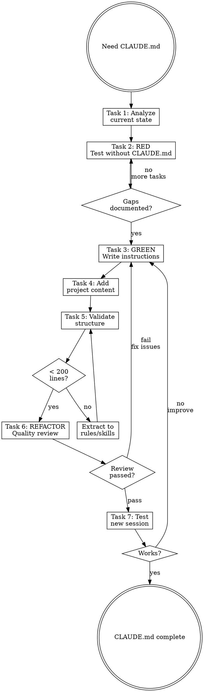

# Writing CLAUDE.md

## Overview

**Writing CLAUDE.md IS establishing project memory that persists across sessions.**

CLAUDE.md is context, not enforced configuration. Claude treats it as high-priority guidance loaded every session. For deterministic enforcement, use hooks.

**Core principle:** Only include what Claude can't figure out from reading the code. Specific and verifiable > vague and aspirational.

**Violating the letter of the rules is violating the spirit of the rules.**

## Routing

**Pattern:** Skill Steps
**Handoff:** none
**Next:** none

## Task Initialization (MANDATORY)

Before ANY action, create task list using TaskCreate:

```
TaskCreate for EACH task below:
- Subject: "[writing-claude-md] Task N: <action>"
- ActiveForm: "<doing action>"
```

**Tasks:**
0. Fetch latest official memory/CLAUDE.md spec
1. Analyze current state
2. Identify documentation gaps
3. Design instruction structure
4. Write CLAUDE.md
5. Add project content
6. Validate structure
7. Review and optimize
8. Test with new session

Announce: "Created 9 tasks (0–8). Starting execution..."

**Execution rules:**
1. `TaskUpdate status="in_progress"` BEFORE starting each task
2. `TaskUpdate status="completed"` ONLY after verification passes
3. If task fails → stay in_progress, diagnose, retry
4. NEVER skip to next task until current is completed
5. At end, `TaskList` to confirm all completed

## Documentation Creation Process

| Phase | Focus | What You Do |
|-------|-------|-------------|
| **Analysis** | Current state | Understand existing setup and identify gaps |
| **Requirements** | Needs assessment | Document what Claude needs to know that isn't in code |
| **Design** | Structure planning | Organize instructions logically and prioritize content |
| **Implementation** | Writing | Create clear, specific, and actionable instructions |
| **Refinement** | Optimization | Remove redundancy, improve clarity and specificity |

## Task 0: Fetch Latest Official Spec

**Goal:** Pull the current Anthropic CLAUDE.md / memory spec before designing — never trust cached memory.

**Action:**
```
Skill tool: fetching-claude-docs
  component: memory
  question: "CLAUDE.md location precedence (project/user/local), import syntax,
             auto-loading behavior, token cost, recommended structure"
```

**Verification:** Received YAML with `source: https://code.claude.com/docs/en/memory.md` and non-empty `spec_excerpt`. Use as authoritative reference; if any rule in this SKILL conflicts with the fetched spec, the fetched spec wins.

## Task 1: Analyze Current State

**Goal:** Understand what exists and what's needed.

**If CLAUDE.md exists:**
1. Read current content
2. Check length (target: < 200 lines)
3. Identify vague or unverifiable instructions
4. Check if content belongs elsewhere (rules, skills, hooks)

**If no CLAUDE.md:** Document what Claude would need to know that it can't learn from reading the code.

**Verification:** Can list specific instructions needed and why each can't be derived from code.

## Task 2: RED - Test Without Proper CLAUDE.md

**Goal:** Observe what Claude gets wrong without guidance.

**Process:**
1. Start session with weak/no CLAUDE.md
2. Ask Claude to perform common project tasks
3. Note where it uses wrong commands, wrong conventions, wrong paths
4. Document specific gaps (not vague "drift")

**What to look for:**
- Wrong build/test commands
- Incorrect assumptions about project structure
- Missing project-specific conventions
- Wrong language or communication style

**Verification:** Documented at least 2 specific things Claude got wrong.

## Task 3: GREEN - Write CLAUDE.md

**Goal:** Create specific, verifiable instructions addressing the gaps you documented.

### What to Include vs Exclude

| Include (Claude can't guess) | Exclude (Claude already knows) |
|------------------------------|--------------------------------|
| Non-obvious bash commands for build/test/deploy | Standard language conventions |
| Code style rules that differ from defaults | Things a linter enforces |
| Repo conventions (branch naming, PR format) | General programming practices |
| Architecture decisions and their rationale | What's obvious from reading code |
| Development environment quirks (env vars, setup) | Detailed API docs (link instead) |
| Common gotchas or non-obvious behavior | Frequently changing information |

### CLAUDE.md Structure

Sections: Code Style, Workflow, Architecture, Gotchas. See [references/examples.md](references/examples.md) for complete example.

### Writing Rules

Instructions MUST be **SPECIFIC**, **VERIFIABLE**, **NON-OBVIOUS**, and **ACTIONABLE**.

Use `MUST`/`NEVER`/`IMPORTANT` sparingly — if everything is critical, nothing is.

### When to Use Other Mechanisms Instead

| If the instruction is... | Use... |
|--------------------------|--------|
| Scoped to specific file paths | `.claude/rules/` with `paths:` glob |
| A reusable multi-step workflow | A skill in `.claude/skills/` |
| Must be deterministically enforced | A hook in settings (exit code 2 = block) |
| Only relevant for certain tasks | A skill (loaded on-demand, saves tokens) |

**Verification:**
- [ ] < 200 lines (hard target; 60 lines optimal)
- [ ] Every instruction is specific and verifiable
- [ ] No content that belongs in rules, skills, or hooks
- [ ] No vague/obvious guidance ("write clean code")
- [ ] Uses emphasis words (`MUST`, `NEVER`) sparingly but effectively

## Task 4: Add Project Content

**Goal:** Add project-specific information that helps agent work effectively.

**Sections to consider:**
1. **Code Style** — Only conventions that differ from defaults
2. **Workflow** — Build, test, deploy commands and patterns
3. **Architecture** — Key directories and their purpose
4. **Gotchas** — Non-obvious behavior, environment quirks

**Token efficiency:**
- CLAUDE.md loads every session — every line costs tokens
- Move domain knowledge to skills (loaded on-demand)
- Move path-scoped conventions to rules (loaded when relevant)
- Link to detailed docs instead of inlining them

**Verification:** Total < 200 lines. Every line earns its place.

## Task 5: Validate Structure

**Goal:** Verify CLAUDE.md is effective and efficient.

**Checklist:**
- [ ] < 200 lines total
- [ ] Every instruction is specific and verifiable
- [ ] No content duplicated in `.claude/rules/` (rules are auto-loaded into context — do NOT Read or Grep rule files; compare against auto-loaded rule content already in context)
- [ ] No multi-step workflows (belongs in skills)
- [ ] No linter-enforceable rules (use hooks instead)
- [ ] Referenced paths actually exist
- [ ] Commands actually work

**Verification:** All checklist items pass.

## Task 6: REFACTOR - Quality Review

**Goal:** Have CLAUDE.md reviewed by claudemd-reviewer subagent.

```
Agent tool:
- subagent_type: "rcc:claudemd-reviewer"
- prompt: "Review CLAUDE.md at [path]"
```

**Interpret YAML output:**
- `pass: true` → Proceed to Task 7
- `pass: false` → Fix all issues listed, re-run reviewer, repeat until `pass: true`

**Verification:** claudemd-reviewer returns YAML with `pass: true`.

## Task 7: Test with New Session

**Goal:** Verify CLAUDE.md works in practice.

**Process:**
1. Start new Claude Code session in project
2. Ask Claude to perform common tasks
3. Verify it uses correct commands, follows conventions
4. Check it doesn't do things the CLAUDE.md says not to
5. If Claude asks questions answered in CLAUDE.md → phrasing is ambiguous, fix it

**Signs of a good CLAUDE.md:**
- Claude uses the right build/test commands without asking
- Claude follows project conventions automatically
- Claude doesn't need correction on documented gotchas

**Signs of a bad CLAUDE.md:**
- Claude ignores instructions → file too long, instruction lost in noise
- Claude asks questions answered in CLAUDE.md → phrasing is ambiguous
- Claude follows CLAUDE.md but breaks things → instructions are wrong/outdated

**Verification:** Claude follows documented conventions correctly over 5+ turns.

## Red Flags - STOP

These thoughts mean you're rationalizing. STOP and reconsider:

- "Skip baseline test, I know what's needed"
- "Instructions can be general guidance"
- "Put all project details in CLAUDE.md"
- "200 lines is too restrictive"
- "Skip reviewer, it's obviously good"
- "Add instructions for things a linter can check"
- "Include standard language conventions"

**All of these mean: You're about to create a bloated, ineffective CLAUDE.md.**

## Common Rationalizations

| Excuse | Reality |
|--------|---------|
| "I know what instructions are needed" | You know what YOU think. Baseline reveals actual gaps. |
| "Instructions can be vague for flexibility" | Vague instructions = Claude interprets freely = no control. |
| "Everything goes in CLAUDE.md" | CLAUDE.md = always loaded = expensive. Use skills and rules. |
| "More instructions = better coverage" | More instructions = more noise = important ones get lost. |
| "Standard practices need documenting" | Claude already knows standard practices. Document the exceptions. |
| "Linter rules belong here" | Linter rules belong in linters + hooks. Deterministic > advisory. |

## Flowchart: CLAUDE.md Creation


```dot
digraph claudemd_creation {
    rankdir=TB;

    start [label="Need CLAUDE.md", shape=doublecircle];
    analyze [label="Task 1: Analyze\ncurrent state", shape=box];
    baseline [label="Task 2: RED\nTest without CLAUDE.md", shape=box];
    verify_red [label="Gaps\ndocumented?", shape=diamond];
    write [label="Task 3: GREEN\nWrite instructions", shape=box];
    content [label="Task 4: Add\nproject content", shape=box];
    validate [label="Task 5: Validate\nstructure", shape=box];
    too_long [label="< 200\nlines?", shape=diamond];
    extract [label="Extract to\nrules/skills", shape=box];
    review [label="Task 6: REFACTOR\nQuality review", shape=box];
    review_pass [label="Review\npassed?", shape=diamond];
    test [label="Task 7: Test\nnew session", shape=box];
    test_pass [label="Works?", shape=diamond];
    done [label="CLAUDE.md complete", shape=doublecircle];

    start -> analyze;
    analyze -> baseline;
    baseline -> verify_red;
    verify_red -> write [label="yes"];
    verify_red -> baseline [label="no\nmore tasks"];
    write -> content;
    content -> validate;
    validate -> too_long;
    too_long -> review [label="yes"];
    too_long -> extract [label="no"];
    extract -> validate;
    review -> review_pass;
    review_pass -> test [label="pass"];
    review_pass -> write [label="fail\nfix issues"];
    test -> test_pass;
    test_pass -> done [label="yes"];
    test_pass -> write [label="no\nimprove"];
}
```

## References

- [references/examples.md](references/examples.md) — Complete CLAUDE.md example and good/bad instructions
- Scaffold script: `${CLAUDE_SKILL_DIR}/scripts/init_claude_md.py` — generates initial CLAUDE.md from project structure
