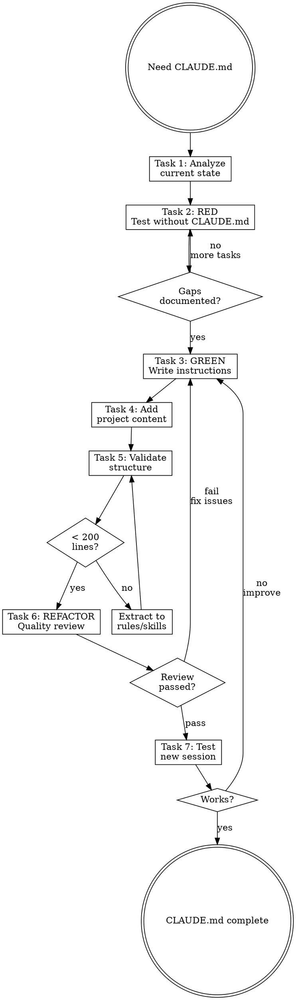

# Flowchart: CLAUDE.md Creation

```dot
digraph claudemd_creation {
    rankdir=TB;

    start [label="Need CLAUDE.md", shape=doublecircle];
    analyze [label="Task 1: Analyze\ncurrent state", shape=box];
    baseline [label="Task 2: RED\nTest without CLAUDE.md", shape=box];
    verify_red [label="Gaps\ndocumented?", shape=diamond];
    write [label="Task 3: GREEN\nWrite instructions", shape=box];
    content [label="Task 4: Add\nproject content", shape=box];
    validate [label="Task 5: Validate\nstructure", shape=box];
    too_long [label="< 200\nlines?", shape=diamond];
    extract [label="Extract to\nrules/skills", shape=box];
    review [label="Task 6: REFACTOR\nQuality review", shape=box];
    review_pass [label="Review\npassed?", shape=diamond];
    test [label="Task 7: Test\nnew session", shape=box];
    test_pass [label="Works?", shape=diamond];
    done [label="CLAUDE.md complete", shape=doublecircle];

    start -> analyze;
    analyze -> baseline;
    baseline -> verify_red;
    verify_red -> write [label="yes"];
    verify_red -> baseline [label="no\nmore tasks"];
    write -> content;
    content -> validate;
    validate -> too_long;
    too_long -> review [label="yes"];
    too_long -> extract [label="no"];
    extract -> validate;
    review -> review_pass;
    review_pass -> test [label="pass"];
    review_pass -> write [label="fail\nfix issues"];
    test -> test_pass;
    test_pass -> done [label="yes"];
    test_pass -> write [label="no\nimprove"];
}
```
