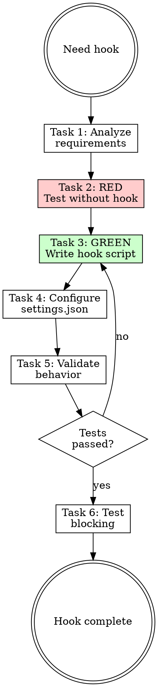

# Writing Hooks

## Overview

**Writing hooks IS creating automated quality gates.**

Hooks run on Claude Code events (PreToolUse, PostToolUse, etc.) and can block actions with exit code 2.

**Core principle:** Hooks enforce what humans forget. Fast checks only—slow hooks kill productivity.

**Violating the letter of the rules is violating the spirit of the rules.**

## Task Initialization (MANDATORY)

Before ANY action, create task list using TaskCreate:

```
TaskCreate for EACH task below:
- Subject: "[writing-hooks] Task N: <action>"
- ActiveForm: "<doing action>"
```

**Tasks:**
1. Analyze requirements
2. RED - Test without hook
3. GREEN - Write hook script
4. Configure settings.json
5. Validate behavior
6. Test blocking

Announce: "Created 6 tasks. Starting execution..."

**Execution rules:**
1. `TaskUpdate status="in_progress"` BEFORE starting each task
2. `TaskUpdate status="completed"` ONLY after verification passes
3. If task fails → stay in_progress, diagnose, retry
4. NEVER skip to next task until current is completed
5. At end, `TaskList` to confirm all completed

## TDD Mapping for Hooks

| TDD Phase | Hook Creation | What You Do |
|-----------|---------------|-------------|
| **RED** | Test without hook | Write code, observe quality issues slip through |
| **Verify RED** | Document violations | Note specific issues that should be caught |
| **GREEN** | Write hook | Create script that catches those issues |
| **Verify GREEN** | Test blocking | Verify exit code 2 blocks violating code |
| **REFACTOR** | Optimize speed | Reduce hook runtime, filter file types |

## Task 1: Analyze Requirements

**Goal:** Understand what quality gate to create.

**Questions to answer:**
- What violation should be blocked?
- Which files should be checked?
- What tool/command performs the check?
- What event triggers the hook?

**Event Selection:**

| Event | When | Use For |
|-------|------|---------|
| `PreToolUse` | Before tool runs | Block bad writes before they happen |
| `PostToolUse` | After tool runs | Validate written code |
| `UserPromptSubmit` | Before prompt processed | Add context to prompts |

**Verification:** Can describe the violation and the command to detect it.

## Task 2: RED - Test Without Hook

**Goal:** Write code WITHOUT the hook. Observe violations that slip through.

**Process:**
1. Ask agent to write code in the target file type
2. Intentionally introduce the violation (bad format, type error, etc.)
3. Observe that Claude Code doesn't catch it
4. Document the specific violation

**Verification:** Documented at least 1 violation that should have been caught.

## Task 3: GREEN - Write Hook Script

**Goal:** Create Python script that catches the violations you documented.

### Hook Structure

```
.claude/hooks/
├── eslint_check.py
├── prettier_check.py
└── typecheck.py
```

### Exit Code Contract

| Code | Meaning | Effect |
|------|---------|--------|
| 0 | Pass | Continue, stdout shown in verbose |
| 2 | Block | Action blocked, stderr fed to Claude |
| Other | Warning | Continue, stderr shown in verbose |

### Hook Template

```python
#!/usr/bin/env python3
"""Hook: [Description]"""
import json
import subprocess
import sys

# Read hook input
data = json.load(sys.stdin)
file_path = data.get('tool_input', {}).get('file_path', '')

# Filter by extension
if not file_path.endswith(('.ts', '.tsx', '.js', '.jsx')):
    sys.exit(0)

# Run check
result = subprocess.run(
    ['npx', 'eslint', '--format', 'compact', file_path],
    capture_output=True,
    text=True
)

# Block on failure
if result.returncode != 0:
    print(f"Lint errors:\\n{result.stdout}", file=sys.stderr)
    sys.exit(2)  # BLOCK

sys.exit(0)  # PASS
```

### Critical Requirements

- **Fast** - Under 5 seconds, hooks run synchronously
- **Filter files** - Only check relevant extensions
- **Limit output** - First 5-10 errors, not all
- **Use Python** - Cross-platform, wrapped shell commands

**Verification:**
- [ ] Script is executable (`chmod +x`)
- [ ] Returns exit code 0 for valid files
- [ ] Returns exit code 2 for violations
- [ ] Runs under 5 seconds

## Task 4: Configure settings.json

**Goal:** Register hook in `.claude/settings.json`.

**CRITICAL:** Use `.claude/settings.json`, NOT `settings.local.json`. Settings are team-shared.

### Configuration Format

```json
{
  "hooks": {
    "PostToolUse": [
      {
        "matcher": "Write|Edit",
        "hooks": [{
          "type": "command",
          "command": "\"$CLAUDE_PROJECT_DIR\"/.claude/hooks/eslint_check.py",
          "timeout": 30
        }]
      }
    ]
  }
}
```

### Matcher Patterns

| Matcher | Matches |
|---------|---------|
| `Write\|Edit` | Write or Edit tools |
| `Bash` | Bash tool only |
| `.*` | All tools |

**Verification:**
- [ ] Hook registered in correct event
- [ ] Matcher targets correct tools
- [ ] Command path uses `$CLAUDE_PROJECT_DIR`
- [ ] Timeout is reasonable (5-30 seconds)

## Task 5: Validate Behavior

**Goal:** Verify hook script works correctly.

**Test command:**
```bash
echo '{"tool_input":{"file_path":"test.ts"}}' | .claude/hooks/your_hook.py
echo $?  # Should be 0 (pass) or 2 (block)
```

**Checklist:**
- [ ] Valid file returns exit code 0
- [ ] Invalid file returns exit code 2
- [ ] Errors go to stderr, info to stdout
- [ ] Completes under 5 seconds

**Verification:** Manual test passes for both valid and invalid inputs.

## Task 6: Test Blocking

**Goal:** Verify hook actually blocks bad code in Claude Code.

**Process:**
1. Ask Claude to write code with the violation
2. Observe hook blocks the action
3. Verify error message is fed back to Claude
4. Claude should fix and retry

**Verification:**
- Hook blocks violating code
- Claude receives feedback and fixes the issue

## Common Hook Patterns

### Linting (ESLint/Ruff)
```python
result = subprocess.run(
    ['npx', 'eslint', '--format', 'compact', file_path],
    capture_output=True, text=True
)
if result.returncode != 0:
    print(result.stdout[:1000], file=sys.stderr)
    sys.exit(2)
```

### Type Checking
```python
result = subprocess.run(
    ['npx', 'tsc', '--noEmit'],
    capture_output=True, text=True
)
errors = [l for l in result.stdout.split('\n') if file_path in l]
if errors:
    print('\n'.join(errors[:5]), file=sys.stderr)
    sys.exit(2)
```

### Auto-Fix (Format)
```python
# Auto-fix instead of blocking
subprocess.run(['npx', 'prettier', '--write', file_path])
print(f"Auto-formatted: {file_path}")
sys.exit(0)  # Don't block, just fix
```

## Red Flags - STOP

These thoughts mean you're rationalizing. STOP and reconsider:

- "Hooks are overkill for this project"
- "I'll just remember to run linting"
- "5 seconds is too strict"
- "Check all files, not just changed ones"
- "Skip testing, the logic is simple"
- "Use settings.local.json for team hooks"

**All of these mean: You're about to create a weak hook. Follow the process.**

## Common Rationalizations

| Excuse | Reality |
|--------|---------|
| "I'll remember to lint" | You won't. Hooks enforce what humans forget. |
| "Slow hooks are thorough" | Slow hooks = disabled hooks. Keep it fast. |
| "Check everything" | Full project check = 30+ seconds. Check changed file only. |
| "settings.local.json" | Local = not shared. Team hooks go in settings.json. |
| "Simple logic doesn't need tests" | Hook failures are silent. Always test. |

## Flowchart: Hook Creation



## References

- [references/static-checks.md](references/static-checks.md) - Complete hook examples
- [references/events.md](references/events.md) - Hook events reference
