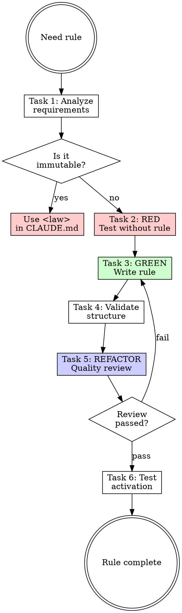

# Writing Rules

## Overview

**Writing rules IS creating scoped, auto-injected conventions.**

Rules auto-inject into context when files match their `paths:` glob. Keep them concise—every line costs tokens.

**Core principle:** Rules = conventions for specific files. Laws = immutable constraints for ALL responses. Don't confuse them.

**Violating the letter of the rules is violating the spirit of the rules.**

## Task Initialization (MANDATORY)

Before ANY action, create task list using TaskCreate:

```
TaskCreate for EACH task below:
- Subject: "[writing-rules] Task N: <action>"
- ActiveForm: "<doing action>"
```

**Tasks:**
1. Analyze requirements
2. RED - Test without rule
3. GREEN - Write rule file
4. Validate structure
5. REFACTOR - Quality review
6. Test activation

Announce: "Created 6 tasks. Starting execution..."

**Execution rules:**
1. `TaskUpdate status="in_progress"` BEFORE starting each task
2. `TaskUpdate status="completed"` ONLY after verification passes
3. If task fails → stay in_progress, diagnose, retry
4. NEVER skip to next task until current is completed
5. At end, `TaskList` to confirm all completed

## TDD Mapping for Rules

| TDD Phase | Rule Creation | What You Do |
|-----------|---------------|-------------|
| **RED** | Test without rule | Work on matching files, note inconsistencies |
| **Verify RED** | Document gaps | Note where conventions were forgotten |
| **GREEN** | Write rule | Create `.claude/rules/` file addressing gaps |
| **Verify GREEN** | Test injection | Verify rule activates on matching files |
| **REFACTOR** | Optimize scope | Tighten `paths:` globs, reduce line count |

## Task 1: Analyze Requirements

**Goal:** Understand what convention to encode and where it applies.

**Questions to answer:**
- What convention needs enforcement?
- Which files should this apply to?
- Is this a LAW (immutable) or RULE (convention)?
- Does this rule already exist?

**Decision:**
```
Is it IMMUTABLE (must display every response)?
├─ Yes → Use <law> in CLAUDE.md, NOT a rule
└─ No → Is it scoped to specific files?
    ├─ Yes → Use paths: glob
    └─ No → Global rule (no paths:)
```

**Verification:** Can state the convention in one sentence and specify the glob pattern.

## Task 2: RED - Test Without Rule

**Goal:** Work on matching files WITHOUT the rule. Note where convention is forgotten.

**Process:**
1. Identify 2-3 files that would match the rule
2. Ask agent to modify those files
3. Observe if conventions are followed naturally
4. Document specific violations

**Verification:** Documented at least 1 instance where convention was not followed.

## Task 3: GREEN - Write Rule File

**Goal:** Create rule file addressing the gaps you documented.

### Rule Location

```
.claude/rules/
├── code-style.md         # Global rule (no paths:)
├── api/
│   └── conventions.md    # paths: src/api/**
└── testing/
    └── guidelines.md     # paths: **/*.test.ts
```

### Rule Format

```yaml
---
paths: src/api/**/*.ts    # Omit for global rules
---

# Rule Title

- Constraint 1 (imperative: "MUST", "NEVER")
- Constraint 2
```

### Writing Rules

**CRITICAL constraints:**
- **< 50 lines** - Auto-injected = expensive tokens
- **Imperative form** - "MUST use", not "try to use"
- **No procedures** - How-to belongs in skills
- **Specific globs** - Narrow scope = fewer injections

<Good>
```yaml
---
paths: src/api/**/*.ts
---

# API Conventions

- MUST validate all input with zod
- MUST return { data, error } shape
- NEVER expose internal errors to client
```
Specific, imperative, scoped.
</Good>

<Bad>
```yaml
---
# No paths = global!
---

# Guidelines

- Try to validate input
- Consider using consistent response shapes
- It's good practice to handle errors
```
Vague, unscoped, passive.
</Bad>

**Verification:**
- [ ] Has frontmatter with `paths:` (or intentionally global)
- [ ] < 50 lines
- [ ] Imperative language ("MUST", "NEVER")
- [ ] Not duplicating existing rules

## Task 4: Validate Structure

**Goal:** Verify rule file structure is correct.

**Checklist:**
- [ ] File is in `.claude/rules/` directory
- [ ] Frontmatter has valid `paths:` glob (or none for global)
- [ ] Body < 50 lines
- [ ] Uses imperative language
- [ ] No how-to instructions (belongs in skills)
- [ ] Not duplicating a `<law>` in CLAUDE.md

**Verification:** All checklist items pass.

## Task 5: REFACTOR - Quality Review

**Goal:** Have rule reviewed by rule-reviewer subagent.

```
Task tool:
- subagent_type: "rcc:rule-reviewer"
- prompt: "Review rule at [path]"
```

**Outcomes:**
- **Pass** → Proceed to Task 6
- **Needs Fix** → Fix issues, re-run reviewer, repeat until Pass
- **Fail** → Major problems, return to Task 3

**Verification:** rule-reviewer returns "Pass" rating.

## Task 6: Test Activation

**Goal:** Verify rule actually activates on matching files.

**Process:**
1. Create/open a file matching the `paths:` pattern
2. Ask agent to modify it
3. Verify agent mentions or follows the rule
4. If global rule, verify it appears in all contexts

**Verification:**
- Rule activates when working on matching files
- Agent follows the conventions in the rule

## Glob Pattern Reference

| Pattern | Matches |
|---------|---------|
| `**/*.ts` | All TypeScript files |
| `src/api/**` | All under src/api/ |
| `*.md` | Markdown in root only |
| `{src,lib}/**/*.ts` | Multiple directories |
| `**/*.{ts,tsx}` | Multiple extensions |
| `!**/node_modules/**` | Exclude pattern |

## Red Flags - STOP

These thoughts mean you're rationalizing. STOP and reconsider:

- "This should be a law, but I'll make it a rule"
- "I don't need paths:, it applies everywhere"
- "50 lines is too restrictive"
- "Skip baseline, I know what's needed"
- "Add how-to instructions here"
- "One big rule is better than multiple small ones"

**All of these mean: You're about to create a weak rule. Follow the process.**

## Common Rationalizations

| Excuse | Reality |
|--------|---------|
| "Laws are overkill" | If it's immutable, it's a law. Period. |
| "Global rules are fine" | Global = always injected. Scope it properly. |
| "50 lines is arbitrary" | 50 lines × N matches = massive token cost. |
| "I can add procedures here" | Rules = what. Skills = how. Keep them separate. |
| "One comprehensive rule" | Multiple focused rules > one bloated rule. |

## Flowchart: Rule Creation



## References

- [references/paths-patterns.md](references/paths-patterns.md) - Advanced glob patterns
- [references/examples.md](references/examples.md) - Rule examples by domain
