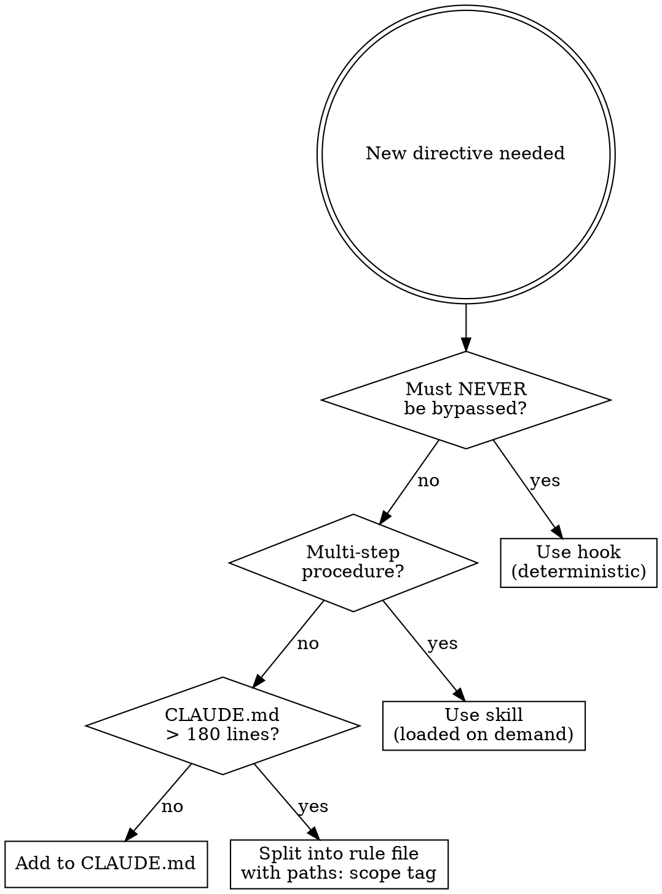

# Writing Rules

## Overview

**Writing rules IS creating self-documenting, scope-tagged conventions that load every session.**

Claude Code loads every file under `.claude/rules/` and `~/.claude/rules/` into context at session start as project instructions — the same mechanism as CLAUDE.md. There is no native `paths:` glob filter; the `paths:` frontmatter is a **convention**, not a load gate. Claude reads `paths:` as scope metadata and applies the rule with judgment on matching files. Every line costs session-start tokens.

**Core principle:** Rules = small, focused, scope-tagged conventions split out of CLAUDE.md to keep that file under budget. CLAUDE.md = top-level project identity, build commands, gotchas. Hard rules that must never be bypassed = hooks (CLAUDE.md compliance is ~70%, not 100%).

**Violating the letter of the rules is violating the spirit of the rules.**

## Routing

**Pattern:** Skill Steps
**Handoff:** none
**Next:** none

## Task Initialization (MANDATORY)

Before ANY action, create task list using TaskCreate:

```
TaskCreate for EACH task below:
- Subject: "[writing-rules] Task N: <action>"
- ActiveForm: "<doing action>"
```

**Tasks:**
0. Fetch latest official rule/skill spec
1. Analyze requirements
2. Identify convention gaps
3. Design rule structure  
4. Write rule file
5. Validate structure
6. Review and optimize
7. Test activation

Announce: "Created 8 tasks (0–7). Starting execution..."

**Execution rules:**
1. `TaskUpdate status="in_progress"` BEFORE starting each task
2. `TaskUpdate status="completed"` ONLY after verification passes
3. If task fails → stay in_progress, diagnose, retry
4. NEVER skip to next task until current is completed
5. At end, `TaskList` to confirm all completed

## Configuration Creation Process

| Phase | Focus | What You Do |
|-------|-------|-------------|
| **Analysis** | Understanding | Identify what convention needs enforcement |
| **Scope Definition** | Targeting | Determine which files need this convention |
| **Design** | Planning | Structure rule content and path patterns |
| **Implementation** | Creation | Write clear, specific configuration rules |
| **Optimization** | Refinement | Streamline scope and improve clarity |

## Task 0: Fetch Latest Official Spec

**Goal:** Pull the current Anthropic spec for path-scoped rules / skill frontmatter before designing — never trust cached memory.

**Action:**
```
Skill tool: fetching-claude-docs
  component: memory
  question: "CLAUDE.md auto-loading behavior, .claude/rules/ directory loading,
             nested CLAUDE.md per directory, @ import syntax, token cost"
```

**Verification:** Received YAML with non-empty `spec_excerpt`. Use as authoritative reference. Note: Anthropic's spec does NOT define a `paths:` frontmatter mechanism — `.claude/rules/*.md` files are loaded unconditionally as project instructions. If the fetched spec contradicts anything in this SKILL, the fetched spec wins.

## Task 1: Analyze Requirements

**Goal:** Understand what convention to encode and where it applies.

**Questions to answer:**
- What convention needs enforcement?
- Which file scope does it apply to (for `paths:` self-documentation)?
- Is it a hard rule that must never be bypassed? → Use a hook, not a rule.
- Does it belong in CLAUDE.md (top-level identity) or in a rule (focused convention split out for budget)?
- Does it require multi-step procedure? → Use a skill, not a rule.
- Does this rule already exist? (compare against auto-loaded rule content in context — do NOT Read or Grep rule files)

**Decision tree:**


```dot
digraph rule_decision {
    rankdir=TB;

    start [label="New directive needed", shape=doublecircle];
    hard [label="Must NEVER\nbe bypassed?", shape=diamond];
    proc [label="Multi-step\nprocedure?", shape=diamond];
    budget [label="CLAUDE.md\n> 180 lines?", shape=diamond];

    hook [label="Use hook\n(deterministic)", shape=box];
    skill [label="Use skill\n(loaded on demand)", shape=box];
    claudemd [label="Add to CLAUDE.md", shape=box];
    rule [label="Split into rule file\nwith paths: scope tag", shape=box];

    start -> hard;
    hard -> hook [label="yes"];
    hard -> proc [label="no"];
    proc -> skill [label="yes"];
    proc -> budget [label="no"];
    budget -> rule [label="yes"];
    budget -> claudemd [label="no"];
}
```

**Verification:** Can state the convention in one sentence, name the file scope it applies to, and confirm it isn't a hard rule (which would belong in a hook).

## Task 2: RED - Test Without Rule

**Goal:** Work on matching files WITHOUT the rule. Note where convention is forgotten.

**Process:**
1. Identify 2-3 files that would match the rule
2. Ask agent to modify those files
3. Observe if conventions are followed naturally
4. Document specific violations

**Verification:** Documented at least 1 instance where convention was not followed.

## Task 3: GREEN - Write Rule File

**Goal:** Create rule file addressing the gaps you documented.

### Rule Location

```
~/.claude/rules/             # User-level (loads in every project session)
.claude/rules/               # Project-level (loads in this project's sessions)
├── code-style.md            # Global rule (no paths: tag)
├── api/
│   └── conventions.md       # paths: ["src/api/**"]  ← scope hint, not load filter
└── testing/
    └── guidelines.md        # paths: ["**/*.test.ts"]
```

### Rule Format

```yaml
---
paths:                        # Optional — self-documenting scope hint
  - "src/api/**/*.ts"
---

# Rule Title

- Constraint 1 (imperative: "MUST", "NEVER")
- Constraint 2
```

### Loading Mechanism (read carefully — common misconception)

Every `.md` under `.claude/rules/` and `~/.claude/rules/` is loaded into context at session start as project instructions, just like CLAUDE.md. This is true regardless of the `paths:` frontmatter.

- `paths:` is a **scope hint** — Claude reads it as metadata and applies the rule with judgment when working on matching files. It does NOT gate loading.
- Therefore every rule line is a session-start token cost. Keep rules small.
- User-level `~/.claude/rules/` and project-level `.claude/rules/` both load; project rules take precedence on conflict.
- Symlinks are supported for sharing rules across projects.
- For deterministic enforcement (block at file-read time, hard-stop a tool call), use a hook — rules cannot enforce, only suggest.

### Writing Rules

**Key constraints:**
- **< 50 lines** — every line costs session-start tokens (loaded unconditionally)
- **Imperative form** — "MUST use", not "try to use"
- **No procedures** — how-to belongs in skills
- **Scope tag** — add `paths:` so future readers (and Claude) know where the rule applies; it's documentation, not a filter

See [references/examples.md](references/examples.md) for good/bad rule examples by domain.

**Content validation checks:**

| Check | Fail condition | Action |
|-------|---------------|--------|
| Line count | > 50 lines | Must simplify or split |
| Procedural content | Contains numbered steps, multi-line code blocks | Extract to skill, rule keeps principle only |
| paths missing | Content targets specific file types but no `paths:` scope tag | Add for self-documentation |
| Hard rule | Says "MUST NEVER" about destructive/irreversible action | Move to hook (deterministic enforcement); a rule alone is ~70% reliable |
| Load budget | Adding this rule pushes session-start total (CLAUDE.md + every rule file) > 300 lines | Warn, simplify, or merge |

**Verification:**
- [ ] Has frontmatter with `paths:` scope tag (or omitted for genuinely cross-cutting rules)
- [ ] < 50 lines
- [ ] Imperative language ("MUST", "NEVER")
- [ ] No procedural content (steps, code blocks as process)
- [ ] Hard rules (destructive ops, irreversible actions) have a backing hook — not just text
- [ ] Not duplicating existing rules or CLAUDE.md (both auto-loaded into context — do NOT Read or Grep rule files)
- [ ] Session-start total (CLAUDE.md + every rule file) still under 300 lines

## Task 4: Validate Structure

**Goal:** Verify rule file structure is correct.

**Checklist:**
- [ ] File is in `.claude/rules/` directory
- [ ] Frontmatter has valid `paths:` glob (or none for global)
- [ ] Body < 50 lines
- [ ] Uses imperative language
- [ ] No how-to instructions (belongs in skills)
- [ ] Not duplicating content already in CLAUDE.md

**Verification:** All checklist items pass.

## Task 5: REFACTOR - Quality Review

**Goal:** Have rule reviewed by rule-reviewer subagent.

```
Agent tool:
- subagent_type: "rcc:rule-reviewer"
- prompt: "Review rule at [path]"
```

**Interpret YAML output:**
- `pass: true` → Proceed to Task 6
- `pass: false` → Fix all issues listed, re-run reviewer, repeat until `pass: true`

**Verification:** rule-reviewer returns YAML with `pass: true`.

## Task 6: Test Activation

**Goal:** Verify rule actually activates on matching files.

**Process:**
1. Create/open a file matching the `paths:` pattern
2. Ask agent to modify it
3. Verify agent mentions or follows the rule
4. If global rule, verify it appears in all contexts

**Verification:**
- Rule activates when working on matching files
- Agent follows the conventions in the rule

## Red Flags - STOP

These thoughts mean you're rationalizing. STOP and reconsider:

- "This should be in CLAUDE.md, but I'll make it a rule" (split for budget reasons, not to hide it)
- "paths: will gate the load so size doesn't matter" (false — every rule loads every session)
- "50 lines is too restrictive"
- "Skip baseline, I know what's needed"
- "Add how-to instructions here" (rule = directive, skill = procedure)
- "One big rule is better than multiple small ones"
- "Writing 'NEVER force-push' in a rule will stop it" (it won't — rule = ~70% suggestion; use a hook for hard stops)
- "I need to explain the steps" (that is a skill, not a rule)
- "Let me add a code example" (a rule is a directive, not a tutorial)

**All of these mean: You're about to create a weak rule. Follow the process.**

## Common Rationalizations

| Excuse | Reality |
|--------|---------|
| "CLAUDE.md is overkill" | If it applies broadly to all work, it belongs in CLAUDE.md. |
| "Global rules are fine" | Global = always injected. Scope it properly. |
| "50 lines is arbitrary" | 50 lines × N matches = massive token cost. |
| "I can add procedures here" | Rules = what. Skills = how. Keep them separate. |
| "One comprehensive rule" | Multiple focused rules > one bloated rule. |

## References

- [references/paths-patterns.md](references/paths-patterns.md) - Glob pattern syntax for `paths:` scope tags
- [references/examples.md](references/examples.md) - Rule examples by domain (includes **Safety Bypass Prevention** baseline templates for git / deploy / destructive ops)
- [references/flowchart.md](references/flowchart.md) - Full creation flowchart (Tasks 1–6)
