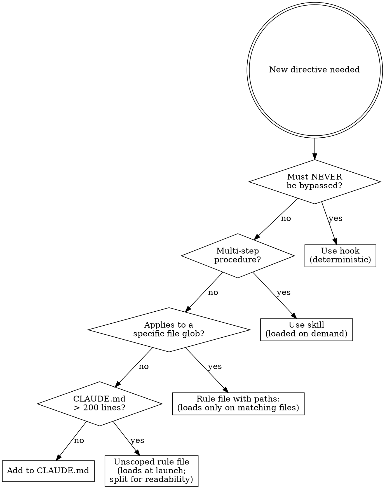

# Writing Rules

## Overview

**Writing rules IS creating focused, path-scoped conventions that load only when they are relevant.**

`paths:` is a real load gate. Per the [official spec](https://code.claude.com/docs/en/memory#path-specific-rules): "Rules without a `paths` field are loaded unconditionally and apply to all files. Path-scoped rules trigger when Claude reads files matching the pattern, not on every tool use." Rules without `paths:` load at launch with the same priority as `.claude/CLAUDE.md`; rules with `paths:` cost nothing until Claude touches a matching file.

**Core principle:** Rules = small, focused conventions, scoped with `paths:` so they stay out of context until needed. CLAUDE.md = top-level project identity, build commands, gotchas — always resident, so keep it under 200 lines. Hard rules that must never be bypassed = hooks (instruction compliance is ~70%, not 100%).

## Task Initialization (MANDATORY)

Follow [task initialization protocol](../../references/task-initialization.md).

**Tasks:**
0. Fetch latest official rule/skill spec
1. Analyze requirements
2. RED - test without rule
3. GREEN - write rule file
4. Validate structure
5. REFACTOR - quality review
6. Test activation

Announce: "Created 7 tasks (0–6). Starting execution..."

## Configuration Creation Process

| Phase | Focus | What You Do |
|-------|-------|-------------|
| **Analysis** | Understanding | Identify what convention needs enforcement |
| **Scope Definition** | Targeting | Determine which files need this convention |
| **Design** | Planning | Structure rule content and path patterns |
| **Implementation** | Creation | Write clear, specific configuration rules |
| **Optimization** | Refinement | Streamline scope and improve clarity |

## Task 0: Fetch Latest Official Spec

**Goal:** Pull the current Anthropic spec for path-scoped rules / skill frontmatter before designing — never trust cached memory.

**Action:**
```
Skill tool: fetching-claude-docs
  component: memory
  question: "CLAUDE.md auto-loading behavior, .claude/rules/ directory loading,
             nested CLAUDE.md per directory, @ import syntax, token cost"
```

**Verification:** Received YAML with non-empty `spec_excerpt`. Use as authoritative reference. If the fetched spec contradicts anything in this SKILL, the fetched spec wins — record the contradiction so this SKILL can be corrected.

## Task 1: Analyze Requirements

**Goal:** Understand what convention to encode and where it applies.

**Questions to answer:**
- What convention needs enforcement?
- Which files does it apply to? A concrete glob → path-scoped rule. "Everything" → CLAUDE.md or an unscoped rule.
- Is it a hard rule that must never be bypassed? → Use a hook, not a rule.
- Does it require multi-step procedure? → Use a skill, not a rule.
- Does this rule already exist? (compare against auto-loaded rule content in context — do NOT Read or Grep rule files)

**Decision tree:**


```dot
digraph rule_decision {
    rankdir=TB;

    start [label="New directive needed", shape=doublecircle];
    hard [label="Must NEVER\nbe bypassed?", shape=diamond];
    proc [label="Multi-step\nprocedure?", shape=diamond];
    scoped [label="Applies to a\nspecific file glob?", shape=diamond];
    budget [label="CLAUDE.md\n> 200 lines?", shape=diamond];

    hook [label="Use hook\n(deterministic)", shape=box];
    skill [label="Use skill\n(loaded on demand)", shape=box];
    claudemd [label="Add to CLAUDE.md", shape=box];
    rule [label="Rule file with paths:\n(loads only on matching files)", shape=box];
    global [label="Unscoped rule file\n(loads at launch;\nsplit for readability)", shape=box];

    start -> hard;
    hard -> hook [label="yes"];
    hard -> proc [label="no"];
    proc -> skill [label="yes"];
    proc -> scoped [label="no"];
    scoped -> rule [label="yes"];
    scoped -> budget [label="no"];
    budget -> global [label="yes"];
    budget -> claudemd [label="no"];
}
```

**Verification:** Can state the convention in one sentence, name the file glob it applies to (or justify why it is genuinely cross-cutting), and confirm it isn't a hard rule (which would belong in a hook).

## Task 2: RED - Test Without Rule

**Goal:** Work on matching files WITHOUT the rule. Note where convention is forgotten.

**Process:**
1. Identify 2-3 files that would match the rule
2. Ask agent to modify those files
3. Observe if conventions are followed naturally
4. Document specific violations

**Verification:** Documented at least 1 instance where convention was not followed.

## Task 3: GREEN - Write Rule File

**Goal:** Create rule file addressing the gaps you documented.

### Rule Location

```
~/.claude/rules/             # User-level (applies to every project)
.claude/rules/               # Project-level (this project only)
├── code-style.md            # Unscoped (no paths:) — loads at launch, every session
├── api/
│   └── conventions.md       # paths: ["src/api/**"]  ← loads only on matching files
└── testing/
    └── guidelines.md        # paths: ["**/*.test.ts"]
```

All `.md` files are discovered recursively, so subdirectories are just organization.

### Rule Format

```yaml
---
paths:                        # Omit only for genuinely cross-cutting rules
  - "src/api/**/*.ts"
---

# Rule Title

- Constraint 1 (imperative: "MUST", "NEVER")
- Constraint 2
```

### Loading Mechanism

- **Without `paths:`** — loaded at launch, every session, same priority as `.claude/CLAUDE.md`. Costs tokens in every conversation.
- **With `paths:`** — loaded when Claude reads a file matching the glob, not on every tool use. Costs nothing until then. This is the reason to scope aggressively.
- User-level `~/.claude/rules/` loads before project rules, giving project rules higher priority.
- Symlinks are supported for sharing rules across projects; circular symlinks are handled.
- For deterministic enforcement (hard-stop a tool call), use a hook — rules cannot enforce, only suggest.

### Writing Rules

**Key constraints:**
- **< 50 lines** — long rules dilute adherence, and unscoped ones cost tokens every session
- **Imperative form** — "MUST use", not "try to use"
- **No procedures** — how-to belongs in skills
- **Scope with `paths:`** — this genuinely gates loading. Omit it only when the rule really applies to all work.

See [references/examples.md](references/examples.md) for good/bad rule examples by domain.

**Content validation checks:**

| Check | Fail condition | Action |
|-------|---------------|--------|
| Line count | > 50 lines | Must simplify or split |
| Procedural content | Contains numbered steps, multi-line code blocks | Extract to skill, rule keeps principle only |
| paths missing | Content targets specific file types but no `paths:` | Add it — this is free context savings, not just documentation |
| paths too broad | `paths: "**/*"` or similar | Equivalent to unscoped but lazier; either narrow it or drop `paths:` entirely |
| Hard rule | Says "MUST NEVER" about destructive/irreversible action | Move to hook (deterministic enforcement); a rule alone is ~70% reliable |
| Load budget | Adding this rule pushes CLAUDE.md + all *unscoped* rules > 200 lines | Warn, simplify, merge, or scope with `paths:` |

**Verification:**
- [ ] Has `paths:` scoping it (or a stated reason why it is genuinely cross-cutting)
- [ ] < 50 lines
- [ ] Imperative language ("MUST", "NEVER")
- [ ] No procedural content (steps, code blocks as process)
- [ ] Hard rules (destructive ops, irreversible actions) have a backing hook — not just text
- [ ] Not duplicating existing rules or CLAUDE.md (compare against content already in context — do NOT Read or Grep rule files)
- [ ] Always-resident total (CLAUDE.md + every unscoped rule) still under 200 lines

## Task 4: Validate Structure

**Goal:** Verify rule file structure is correct.

**Checklist:**
- [ ] File is under `.claude/rules/` (nested subdirectories are fine — discovery is recursive)
- [ ] Frontmatter has valid `paths:` glob (or none, deliberately, for a cross-cutting rule)
- [ ] Body < 50 lines
- [ ] Uses imperative language
- [ ] No how-to instructions (belongs in skills)
- [ ] Not duplicating content already in CLAUDE.md

**Verification:** All checklist items pass.

## Task 5: REFACTOR - Quality Review

**Goal:** Have rule reviewed by rule-reviewer subagent.

```
Agent tool:
- subagent_type: "rcc:rule-reviewer"
- prompt: "Review rule at [path]"
```

**Interpret YAML output:**
- `pass: true` → Proceed to Task 6
- `pass: false` → Fix all issues listed, re-run reviewer, repeat until `pass: true`

**Verification:** rule-reviewer returns YAML with `pass: true`.

## Task 6: Test Activation

**Goal:** Verify rule actually activates on matching files.

**Process:**
1. Create/open a file matching the `paths:` pattern
2. Ask agent to modify it
3. Verify agent mentions or follows the rule
4. If global rule, verify it appears in all contexts

**Verification:**
- Rule activates when working on matching files
- Agent follows the conventions in the rule

## Red Flags - STOP

These thoughts mean you're rationalizing. STOP and reconsider:

- "This should be in CLAUDE.md, but I'll make it a rule" (scope for relevance, not to hide it)
- "paths: gates the load so size doesn't matter" (a matched rule is still fully resident afterward — keep it small)
- "Skip paths:, it's just documentation" (false — it is a real load gate; omitting it makes the rule always-resident)
- "50 lines is too restrictive"
- "Skip baseline, I know what's needed"
- "Add how-to instructions here" (rule = directive, skill = procedure)
- "One big rule is better than multiple small ones"
- "Writing 'NEVER force-push' in a rule will stop it" (it won't — rule = ~70% suggestion; use a hook for hard stops)
- "I need to explain the steps" (that is a skill, not a rule)
- "Let me add a code example" (a rule is a directive, not a tutorial)

**All of these mean: You're about to create a weak rule. Follow the process.**

## Common Rationalizations

| Excuse | Reality |
|--------|---------|
| "CLAUDE.md is overkill" | If it applies broadly to all work, it belongs in CLAUDE.md. |
| "Unscoped rules are fine" | Unscoped = loaded at launch in every session, forever. Add `paths:`. |
| "50 lines is arbitrary" | Long rules dilute adherence, and unscoped ones bill every session. |
| "I can add procedures here" | Rules = what. Skills = how. Keep them separate. |
| "One comprehensive rule" | Multiple focused rules > one bloated rule. |

## References

- [references/paths-patterns.md](references/paths-patterns.md) - Glob pattern syntax for `paths:` scope tags
- [references/examples.md](references/examples.md) - Rule examples by domain (includes **Safety Bypass Prevention** baseline templates for git / deploy / destructive ops)
- [references/flowchart.md](references/flowchart.md) - Full creation flowchart (Tasks 1–6; Task 0 fetches the spec first)
