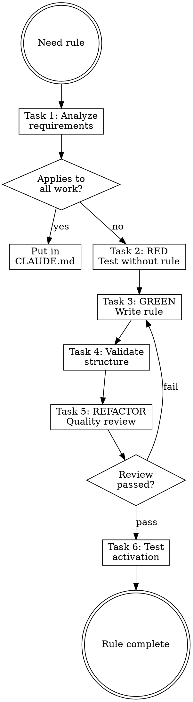

# Flowchart: Rule Creation

```dot
digraph rule_creation {
    rankdir=TB;

    start [label="Need rule", shape=doublecircle];
    analyze [label="Task 1: Analyze\nrequirements", shape=box];
    is_broad [label="Applies to\nall work?", shape=diamond];
    use_claudemd [label="Put in\nCLAUDE.md", shape=box];
    baseline [label="Task 2: RED\nTest without rule", shape=box];
    write [label="Task 3: GREEN\nWrite rule", shape=box];
    validate [label="Task 4: Validate\nstructure", shape=box];
    review [label="Task 5: REFACTOR\nQuality review", shape=box];
    review_pass [label="Review\npassed?", shape=diamond];
    test [label="Task 6: Test\nactivation", shape=box];
    done [label="Rule complete", shape=doublecircle];

    start -> analyze;
    analyze -> is_broad;
    is_broad -> use_claudemd [label="yes"];
    is_broad -> baseline [label="no"];
    baseline -> write;
    write -> validate;
    validate -> review;
    review -> review_pass;
    review_pass -> test [label="pass"];
    review_pass -> write [label="fail"];
    test -> done;
}
```
