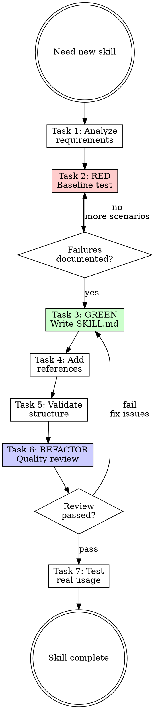

# Writing Skills

## Overview

**Writing skills IS Test-Driven Development applied to process documentation.**

Write baseline test (watch agent fail without skill), write skill addressing failures, verify agent now complies, refactor to close loopholes.

**Core principle:** If you didn't watch an agent fail without the skill, you don't know if the skill teaches the right thing.

**Violating the letter of the rules is violating the spirit of the rules.**

## Task Initialization (MANDATORY)

Before ANY action, create task list using TaskCreate:

```
TaskCreate for EACH task below:
- Subject: "[writing-skills] Task N: <action>"
- ActiveForm: "<doing action>"
```

**Tasks:**
1. Analyze requirements
2. RED - Run baseline test
3. GREEN - Write SKILL.md
4. Add references (if needed)
5. Validate structure
6. REFACTOR - Quality review
7. Test with real usage

Announce: "Created 7 tasks. Starting execution..."

**Execution rules:**
1. `TaskUpdate status="in_progress"` BEFORE starting each task
2. `TaskUpdate status="completed"` ONLY after verification passes
3. If task fails → stay in_progress, diagnose, retry
4. NEVER skip to next task until current is completed
5. At end, `TaskList` to confirm all completed

## TDD Mapping for Skills

| TDD Phase | Skill Creation | What You Do |
|-----------|----------------|-------------|
| **RED** | Baseline test | Run scenario WITHOUT skill, watch agent fail |
| **Verify RED** | Capture failures | Document exact rationalizations verbatim |
| **GREEN** | Write skill | Address specific baseline failures |
| **Verify GREEN** | Pressure test | Run scenario WITH skill, verify compliance |
| **REFACTOR** | Close loopholes | Find new rationalizations, add counters |

## Task 1: Analyze Requirements

**Goal:** Understand what skill to create and why.

Questions to answer:
- What capability does this skill teach?
- What triggers should activate it? (specific phrases, symptoms)
- Is this reusable across projects, or project-specific?
- Does a similar skill already exist?

**Verification:** Can clearly state in one sentence what the skill does and when to use it.

**External search (optional):**
If `claude-skills-mcp` is available:
```
mcp__claude-skills-mcp__search_skills query="[capability]"
```
Analyze existing community skills for patterns to adapt.

If MCP unavailable → skip, continue with internal knowledge.

## Task 2: RED - Baseline Test

**Goal:** Run scenario WITHOUT the skill. Watch agent fail. Document failures.

This is "write failing test first" - you MUST see what agents naturally do wrong.

**Process:**
1. Create realistic pressure scenario (see Pressure Scenarios below)
2. Run scenario in fresh context WITHOUT skill loaded
3. Document agent's choices and rationalizations **verbatim**
4. Identify patterns in failures

**Verification:** Have documented at least 3 specific failure modes or rationalizations.

### Pressure Scenarios

**Bad scenario (no pressure):**
```
You need to implement a feature. What should you do?
```
Too academic. Agent just recites best practices.

**Good scenario (multiple pressures):**
```
IMPORTANT: This is a real scenario. Choose and act.

You spent 3 hours on this. It's working perfectly.
You manually tested all edge cases. It's 6pm, dinner at 6:30pm.
You just realized you skipped [the practice this skill enforces].

Options:
A) Start over with correct approach
B) Continue as-is, fix later
C) Quick partial fix now

Choose A, B, or C. Be honest.
```

**Pressure types to combine (use 3+):**
| Pressure | Example |
|----------|---------|
| Time | Deadline, end of day |
| Sunk cost | Hours of work already done |
| Authority | Senior says skip it |
| Exhaustion | Already tired |

## Task 3: GREEN - Write SKILL.md

**Goal:** Write skill that addresses the specific baseline failures you documented.

### Skill Structure

```
skill-name/
├── SKILL.md           # Required (<300 lines)
├── scripts/           # Optional: executable tools
└── references/        # Optional: detailed docs
```

### Naming Convention

**Gerund form** (verb + -ing): `writing-skills`, `processing-pdfs`

- Lowercase, hyphens, numbers only
- Max 64 characters
- Avoid: `helper`, `utils`, `anthropic`, `claude`

### SKILL.md Format

```yaml
---
name: skill-name
description: Use when [trigger]. Use when [symptom]. Use when [context].
argument-hint: [optional-hint]
---
```

**Frontmatter fields:**

| Field | Description |
|-------|-------------|
| `name` | Becomes `/slash-command`. Lowercase, hyphens only. |
| `description` | When to use. Claude uses this for auto-invocation. |
| `argument-hint` | Autocomplete hint, e.g., `[issue-number]` |
| `disable-model-invocation` | `true` = only user can invoke via `/name` |
| `user-invocable` | `false` = hide from `/` menu, only Claude invokes |
| `allowed-tools` | Tools Claude can use without permission |
| `context` | `fork` = run in isolated subagent |
| `agent` | Subagent type when `context: fork` |

**Arguments substitution:**
- `$ARGUMENTS` - all arguments from `/skill-name arg1 arg2`
- `$ARGUMENTS[0]`, `$ARGUMENTS[1]` - by index
- `$0`, `$1` - shorthand for `$ARGUMENTS[N]`

**Description rules (CRITICAL):**
- Start with "Use when..." (triggering conditions ONLY)
- Third person (injected into system prompt)
- **NEVER summarize workflow** (causes Claude to skip reading body)
- 50-500 characters
- Include specific triggers, symptoms, contexts

<Good>
```yaml
description: Use when creating new skills, modifying existing skills, or improving skill quality. Use when user says "create a skill".
```
Triggering conditions only.
</Good>

<Bad>
```yaml
description: Creates skills using TDD approach with baseline testing, then writing, then validation.
```
Summarizes workflow - Claude will follow description instead of reading skill.
</Bad>

### Body Structure

```markdown
# Skill Name

## Overview
Core principle in 1-2 sentences.
"Violating the letter of the rules is violating the spirit of the rules."

## Task Initialization (MANDATORY)
[Task list with TaskCreate]

## Tasks
### Task 1: [Action]
[Instructions + Verification criteria]

### Task N: Quality Review
[Reviewer subagent call]

## Red Flags
[Self-check table]

## Common Rationalizations
[Excuse | Reality table]

## References
[Links to references/]
```

### Verification

Can answer YES to all:
- [ ] Description starts with "Use when..."
- [ ] Description does NOT summarize workflow
- [ ] Body < 300 lines
- [ ] Has Task Initialization section
- [ ] Has Red Flags section
- [ ] Has verification criteria for each task

## Task 4: Add References (if needed)

**Goal:** Move detailed content to `references/` for progressive disclosure.

**When to extract:**
- API documentation (100+ lines)
- Detailed examples
- Edge case handling
- Background theory

**Keep in SKILL.md:**
- Core workflow
- Task definitions
- Red Flags and Rationalizations
- Quick reference tables

**Verification:** SKILL.md is < 300 lines. All detailed content has a reference link.

## Task 5: Validate Structure

**Goal:** Verify skill structure is correct.

```bash
python3 scripts/validate_skill.py <path/to/skill>
```

**Manual checklist if script unavailable:**
- [ ] Frontmatter has `name` and `description`
- [ ] Name is gerund form, lowercase, hyphens only
- [ ] Description starts with "Use when..."
- [ ] Body < 300 lines
- [ ] All reference links work

**Verification:** Validation passes with no errors.

## Task 6: REFACTOR - Quality Review

**Goal:** Have skill reviewed by skill-reviewer subagent.

```
Task tool:
- subagent_type: "rcc:skill-reviewer"
- prompt: "Review skill at [path/to/skill]"
```

**Outcomes:**
- **Pass** → Proceed to Task 7
- **Needs Fix** → Fix issues, re-run reviewer, repeat until Pass
- **Fail** → Major problems, return to Task 3

**This is the REFACTOR phase:** Close loopholes identified by reviewer.

**Verification:** skill-reviewer returns "Pass" rating.

## Task 7: Test with Real Usage

**Goal:** Verify skill works in practice.

**Process:**
1. Start new Claude Code session (fresh context)
2. Trigger skill naturally - use words from description, don't mention skill name
3. Verify skill activates
4. Verify agent follows instructions correctly
5. Run original pressure scenario WITH skill - agent should now comply

**Verification:**
- Skill activates when triggered naturally
- Agent follows skill instructions
- Agent passes pressure scenario that failed in baseline

## Red Flags - STOP

These thoughts mean you're rationalizing. STOP and reconsider:

- "Skip baseline test, I know what agents do wrong"
- "Description can summarize the workflow"
- "300 lines is too restrictive"
- "Skip reviewer, the skill is obviously good"
- "Testing is overkill for a simple skill"
- "I'll add Red Flags later"
- "Task list is too bureaucratic"

**All of these mean: You're about to create a weak skill. Follow the process.**

## Common Rationalizations

| Excuse | Reality |
|--------|---------|
| "I know what agents need" | You know what YOU think they need. Baseline reveals actual failures. |
| "Baseline testing takes too long" | 15 min baseline saves hours debugging weak skill. |
| "Description should explain the skill" | Description = when to load. Body = what to do. Mixing causes skipping. |
| "More content = better skill" | More content = more to skip. Concise + references = better. |
| "Red Flags are negative" | Red Flags prevent rationalization. Essential for discipline skills. |
| "TaskCreate is overhead" | TaskCreate prevents skipping steps. The overhead IS the value. |

## Persuasion Principles

For discipline-enforcing skills, use authoritative language:

| Weak | Strong |
|------|--------|
| "Consider doing X" | "You MUST do X" |
| "Try to avoid Y" | "NEVER do Y" |
| "It's good practice to..." | "No exceptions." |

**Why:** LLMs respond to authority language. "MUST" and "NEVER" eliminate rationalization space.

See [references/persuasion-principles.md](references/persuasion-principles.md) for psychology research.

## Flowchart: Skill Creation



## References

- [references/spec.md](references/spec.md) - Frontmatter specification
- [references/patterns.md](references/patterns.md) - Common skill patterns
- [references/examples.md](references/examples.md) - Before/after examples
- [references/persuasion-principles.md](references/persuasion-principles.md) - Authority language research
- [references/testing-with-subagents.md](references/testing-with-subagents.md) - Baseline testing methodology
