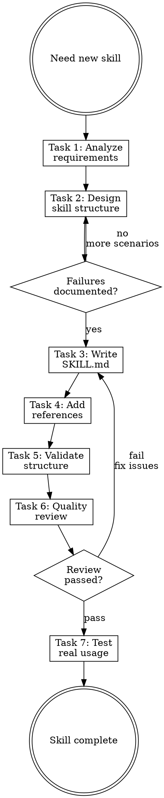

# Writing Skills

## Overview

**Writing skills IS structured documentation creation for process guidance.**

Analyze requirements clearly, design skill structure thoughtfully, implement with precision, validate functionality, and iterate based on feedback.

**Core principle:** Clear requirements and structured design lead to effective skills that truly guide agent behavior.

**Violating the letter of the rules is violating the spirit of the rules.**

## Routing

**Pattern:** Skill Steps
**Handoff:** none
**Next:** none

## Task Initialization (MANDATORY)

Before ANY action, create task list using TaskCreate:

```
TaskCreate for EACH task below:
- Subject: "[writing-skills] Task N: <action>"
- ActiveForm: "<doing action>"
```

**Tasks:**
1. Analyze requirements
2. Design skill structure  
3. Implement SKILL.md
4. Add references (if needed)
5. Validate structure
6. Review and improve
7. Test with real usage

Announce: "Created 7 tasks. Starting execution..."

**Execution rules:**
1. `TaskUpdate status="in_progress"` BEFORE starting each task
2. `TaskUpdate status="completed"` ONLY after verification passes
3. If task fails → stay in_progress, diagnose, retry
4. NEVER skip to next task until current is completed
5. At end, `TaskList` to confirm all completed

## Skill Creation Process

| Phase | Focus | What You Do |
|-------|-------|-------------|
| **Requirements** | Understanding | Analyze what capability is needed and why |
| **Design** | Structure | Plan skill organization, triggers, and content |
| **Implementation** | Creation | Write skill following design and best practices |
| **Validation** | Testing | Verify skill works correctly in real scenarios |
| **Improvement** | Refinement | Iterate based on feedback and usage patterns |

## Task 1: Analyze Requirements

**Goal:** Understand what skill to create and why. Present full analysis to user for confirmation.

Analyze and answer ALL questions below:
- What capability does this skill teach?
- What triggers should activate it? (specific phrases, symptoms)
- Is this reusable across projects, or project-specific?
- Does a similar skill already exist?
- What are the key design decisions? List alternatives considered and chosen approach with rationale.

**External search (optional):** If `claude-skills-mcp` available, search for existing community skills to adapt.

**MANDATORY: Present analysis to user.** Display ALL answers above in full detail, then ask user to confirm before proceeding. Do NOT summarize into a single sentence. Do NOT skip to next task without explicit user approval.

**Verification:** User has reviewed the full analysis and confirmed the direction.

## Task 2: Design Skill Structure

**Goal:** Plan the skill's organization, triggers, and content.

**Design considerations:**
1. What specific capability does this skill provide?
2. When should the skill be triggered? (specific phrases, symptoms)
3. What are the key tasks and workflow steps?
4. What supporting materials are needed? (references, examples)

**Structure planning:**
- Clear trigger conditions in description
- Logical task sequence
- Verification criteria for each task
- Red flags and common mistakes

**Verification:** Have clear design plan with triggers, tasks, and structure defined.

## Task 3: Implement SKILL.md

**Goal:** Create the skill following the design plan and best practices.

### Skill Structure

```
skill-name/
├── SKILL.md           # Required (<300 lines)
├── scripts/           # Optional: executable tools
└── references/        # Optional: detailed docs
```

**If the skill includes scripts:** Read [cross-platform-scripts.md](../../references/cross-platform-scripts.md) for mandatory cross-platform rules (paths, shell commands, line endings).

### Naming Convention

**Gerund form** (verb + -ing): `writing-skills`, `processing-pdfs`

- Lowercase, hyphens, numbers only
- Max 64 characters
- Avoid: `helper`, `utils`, `anthropic`, `claude`

### SKILL.md Format

See [references/spec.md](references/spec.md) for full frontmatter specification (fields, arguments, model selection, context:fork).

### Context and Agent Selection

| Use Case | context | agent | Rationale |
|----------|---------|-------|-----------|
| Inline knowledge (conventions, patterns) | (none) | (none) | Runs in main conversation, Claude applies alongside current context |
| Analysis or exploration task | `fork` | `Explore` | Isolated context, read-only tools, prevents context pollution |
| Planning task | `fork` | `Plan` | Isolated context, research-focused |
| Task with side effects (deploy, commit) | `fork` | (none) | Isolated from main conversation, uses general-purpose agent |
| Default for most skills | (none) | (none) | Runs inline, cheapest, fastest |

**When to use `context: fork`:**
- Skill generates large output that would pollute main context
- Skill is a self-contained task (not reference material)
- Skill needs different tools than the main conversation

**When NOT to use `context: fork`:**
- Skill provides conventions or guidelines (needs main context to apply them)
- Skill content is reference material for ongoing work
- Skill needs access to conversation history

**Key rules (CRITICAL):**
- Name: gerund form, lowercase, hyphens only, max 64 chars
- Description: starts with "Use when...", third person, NEVER summarize workflow
- Body: < 300 lines, detailed content goes to `references/`

### Body Structure

Required sections: Overview, Routing, Task Initialization, Tasks (with verification each), Red Flags, Common Rationalizations, Flowchart, References. See [references/patterns.md](references/patterns.md) for full template.

### Verification

Can answer YES to all:
- [ ] Description starts with "Use when..."
- [ ] Description does NOT summarize workflow
- [ ] Body < 300 lines
- [ ] Has Task Initialization section
- [ ] Has Red Flags section
- [ ] Has verification criteria for each task

## Task 4: Add References (if needed)

**Goal:** Move detailed content to `references/` for progressive disclosure.

**When to extract:**
- API documentation (100+ lines)
- Detailed examples
- Edge case handling
- Background theory

**Keep in SKILL.md:**
- Core workflow
- Task definitions
- Red Flags and Rationalizations
- Quick reference tables

**Verification:** SKILL.md is < 300 lines. All detailed content has a reference link.

## Task 5: Validate Structure

**Goal:** Verify skill structure is correct.

Use [scripts/validate_skill.py](scripts/validate_skill.py) to run automated validation:

```bash
python3 "${CLAUDE_SKILL_DIR}/scripts/validate_skill.py" <path/to/skill>
```

**Manual checklist if script unavailable:**
- [ ] Frontmatter has `name` and `description`
- [ ] Name is gerund form, lowercase, hyphens only
- [ ] Description starts with "Use when..."
- [ ] Body < 300 lines
- [ ] All reference links work

**Verification:** Validation passes with no errors.

## Task 6: REFACTOR - Quality Review

**Goal:** Have skill reviewed by skill-reviewer subagent.

```
Agent tool:
- subagent_type: "rcc:skill-reviewer"
- prompt: "Review skill at [path/to/skill]"
```

**Interpret YAML output:**
- `pass: true` → Proceed to Task 7
- `pass: false` → Fix all issues listed, re-run reviewer, repeat until `pass: true`

**This is the improvement phase:** Address issues and refine quality based on reviewer feedback.

**Verification:** skill-reviewer returns YAML with `pass: true`.

## Task 7: Test with Real Usage

**Goal:** Verify skill works in practice.

**Process:**
1. Start new Claude Code session (fresh context)
2. Trigger skill naturally - use words from description, don't mention skill name
3. Verify skill activates
4. Verify agent follows instructions correctly
5. Run original pressure scenario WITH skill - agent should now comply

**Verification:**
- Skill activates when triggered naturally
- Agent follows skill instructions
- Agent passes pressure scenario that failed in baseline

## Red Flags - STOP

These thoughts mean you're rationalizing. STOP and reconsider:

- "Skip requirements analysis, I know what's needed"
- "Description can summarize the workflow"
- "300 lines is too restrictive"
- "Skip reviewer, the skill is obviously good"
- "Testing is overkill for a simple skill"
- "I'll add Red Flags later"
- "Task list is too bureaucratic"

**All of these mean: You're about to create a weak skill. Follow the process.**

## Common Rationalizations

| Excuse | Reality |
|--------|---------|
| "I know what agents need" | You know what YOU think they need. Baseline reveals actual failures. |
| "Baseline testing takes too long" | 15 min baseline saves hours debugging weak skill. |
| "Description should explain the skill" | Description = when to load. Body = what to do. Mixing causes skipping. |
| "More content = better skill" | More content = more to skip. Concise + references = better. |
| "Red Flags are negative" | Red Flags prevent rationalization. Essential for discipline skills. |
| "TaskCreate is overhead" | TaskCreate prevents skipping steps. The overhead IS the value. |

## Flowchart: Skill Creation


```dot
digraph skill_creation {
    rankdir=TB;

    start [label="Need new skill", shape=doublecircle];
    analyze [label="Task 1: Analyze\nrequirements", shape=box];
    baseline [label="Task 2: Design\nskill structure", shape=box];
    verify_red [label="Failures\ndocumented?", shape=diamond];
    write [label="Task 3: Write\nSKILL.md", shape=box];
    refs [label="Task 4: Add\nreferences", shape=box];
    validate [label="Task 5: Validate\nstructure", shape=box];
    review [label="Task 6: Quality\nreview", shape=box];
    review_pass [label="Review\npassed?", shape=diamond];
    test [label="Task 7: Test\nreal usage", shape=box];
    done [label="Skill complete", shape=doublecircle];

    start -> analyze;
    analyze -> baseline;
    baseline -> verify_red;
    verify_red -> write [label="yes"];
    verify_red -> baseline [label="no\nmore scenarios"];
    write -> refs;
    refs -> validate;
    validate -> review;
    review -> review_pass;
    review_pass -> test [label="pass"];
    review_pass -> write [label="fail\nfix issues"];
    test -> done;
}
```

## References

- [references/spec.md](references/spec.md) - Frontmatter specification
- [references/patterns.md](references/patterns.md) - Common skill patterns
- [references/examples.md](references/examples.md) - Before/after examples
- [references/persuasion-principles.md](references/persuasion-principles.md) - Authority language research
- [references/testing-with-subagents.md](references/testing-with-subagents.md) - Baseline testing methodology
