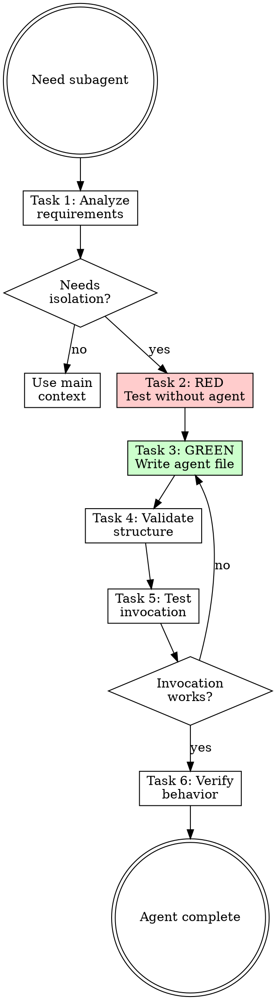

# Writing Subagents

## Overview

**Writing subagents IS creating specialized workers with isolated contexts.**

Subagents run via the Task tool with their own context window, tools, and system prompt. Use for tasks that benefit from focused expertise.

**Core principle:** One agent, one responsibility. Bloated agents become unfocused.

**Violating the letter of the rules is violating the spirit of the rules.**

## Task Initialization (MANDATORY)

Before ANY action, create task list using TaskCreate:

```
TaskCreate for EACH task below:
- Subject: "[writing-subagents] Task N: <action>"
- ActiveForm: "<doing action>"
```

**Tasks:**
1. Analyze requirements
2. RED - Test without subagent
3. GREEN - Write agent file
4. Validate structure
5. Test invocation
6. Verify behavior

Announce: "Created 6 tasks. Starting execution..."

**Execution rules:**
1. `TaskUpdate status="in_progress"` BEFORE starting each task
2. `TaskUpdate status="completed"` ONLY after verification passes
3. If task fails → stay in_progress, diagnose, retry
4. NEVER skip to next task until current is completed
5. At end, `TaskList` to confirm all completed

## TDD Mapping for Subagents

| TDD Phase | Subagent Creation | What You Do |
|-----------|-------------------|-------------|
| **RED** | Test without agent | Perform task in main context, note issues |
| **Verify RED** | Document problems | Note context pollution, scope creep |
| **GREEN** | Write agent | Create focused agent addressing problems |
| **Verify GREEN** | Test invocation | Verify agent runs with correct tools/prompt |
| **REFACTOR** | Optimize | Reduce tools, sharpen system prompt |

## Task 1: Analyze Requirements

**Goal:** Understand what specialized task needs isolation.

**Questions to answer:**
- What specific task needs a subagent?
- Why can't the main agent do this?
- What tools does this agent need?
- Should it be proactive or manual?

**When to use subagents:**
- Task needs isolated context (code review, deep analysis)
- Task would pollute main conversation
- Task is repetitive and well-defined
- Task benefits from specialized system prompt

**Verification:** Can describe the agent's single responsibility in one sentence.

## Task 2: RED - Test Without Subagent

**Goal:** Perform the task in main context. Note issues that arise.

**Process:**
1. Perform the intended task in main conversation
2. Observe context pollution or scope creep
3. Note where specialized focus would help
4. Document specific problems

**Common problems without subagents:**
- Context window fills with review comments
- Main agent loses focus on primary task
- Repeated tasks lack consistency
- No clean handoff point

**Verification:** Documented at least 1 issue from running task in main context.

## Task 3: GREEN - Write Agent File

**Goal:** Create agent file addressing the problems you documented.

### Agent Location

```
.claude/agents/      # Project-level
~/.claude/agents/    # User-level (global)
```

### Agent Format

```yaml
---
name: agent-name
description: What this agent does. Use proactively when [triggers].
tools: Read, Grep, Glob, Bash
model: sonnet
---

System prompt for the agent.

## Role
[Clear description of the agent's responsibility]

## Process
[Steps the agent should follow]

## Output Format
[Expected output structure]
```

### Configuration Fields

| Field | Required | Description |
|-------|----------|-------------|
| `name` | Yes | Lowercase with hyphens: `code-reviewer` |
| `description` | Yes | Include "Use proactively when..." for auto-invoke |
| `tools` | No | CSV list; omit = inherit all |
| `model` | No | `sonnet`, `opus`, `haiku`, `inherit` |
| `skills` | No | Auto-load skills when invoked |
| `permissionMode` | No | `default`, `acceptEdits`, `bypassPermissions`, `plan` |

### Model Selection

| Model | Use Case | Cost |
|-------|----------|------|
| `haiku` | Fast exploration, simple validation | $ |
| `sonnet` | Balanced (default) | $$ |
| `opus` | Complex reasoning, architecture | $$$ |

### Tool Recommendations

| Agent Type | Tools |
|------------|-------|
| Code reviewer | `Read, Grep, Glob` |
| Test runner | `Read, Bash, Grep` |
| Explorer | `Read, Glob, Grep, Bash` |
| Writer | `Read, Edit, Write` |

**Verification:**
- [ ] Name is lowercase with hyphens
- [ ] Description has clear trigger
- [ ] Tools are minimal (principle of least privilege)
- [ ] System prompt is focused

## Task 4: Validate Structure

**Goal:** Verify agent file structure is correct.

**Checklist:**
- [ ] File is in `.claude/agents/` directory
- [ ] Frontmatter has `name` and `description`
- [ ] Name matches filename (minus .md)
- [ ] Tools are appropriate for the task
- [ ] System prompt is actionable
- [ ] No overlapping responsibility with other agents

**Verification:** All checklist items pass.

## Task 5: Test Invocation

**Goal:** Verify agent can be invoked via Task tool.

**Test:**
```
Task tool:
- subagent_type: "[plugin:]agent-name"
- prompt: "Test invocation"
```

**Check:**
- Agent loads correctly
- System prompt is applied
- Tool restrictions work
- Model selection honored

**Verification:** Agent invocation succeeds without errors.

## Task 6: Verify Behavior

**Goal:** Run agent on real task and verify quality.

**Process:**
1. Invoke agent with real task input
2. Observe agent follows its system prompt
3. Verify output matches expected format
4. Check agent stays within its scope

**Verification:**
- Agent produces expected output
- Agent uses only granted tools
- Agent doesn't exceed its scope

## Trigger Patterns

### Proactive (Auto-Invoke)

Include in description:
- "Use proactively when..."
- "Use immediately after..."
- "MUST BE USED when..."

```yaml
description: Reviews code quality. Use proactively when completing any implementation task.
```

### Manual (Explicit Invoke)

Omit proactive triggers:
```yaml
description: Deep security analysis of authentication code.
```

## Red Flags - STOP

These thoughts mean you're rationalizing. STOP and reconsider:

- "This agent needs all tools"
- "One agent can handle multiple responsibilities"
- "Main context is fine, don't need isolation"
- "Skip testing, the prompt is simple"
- "Use opus for everything"

**All of these mean: You're about to create a weak agent. Follow the process.**

## Common Rationalizations

| Excuse | Reality |
|--------|---------|
| "Needs all tools" | More tools = more ways to go wrong. Minimize. |
| "Multi-purpose agent" | Jack of all trades = master of none. One job. |
| "Main context works" | Context pollution is invisible until it's a problem. |
| "Simple prompt" | Simple ≠ correct. Test the behavior. |
| "Opus is better" | Opus costs 15x haiku. Use appropriate model. |

## Flowchart: Subagent Creation



## References

- [references/examples.md](references/examples.md) - Subagent templates
- [references/tools.md](references/tools.md) - Available tools reference
