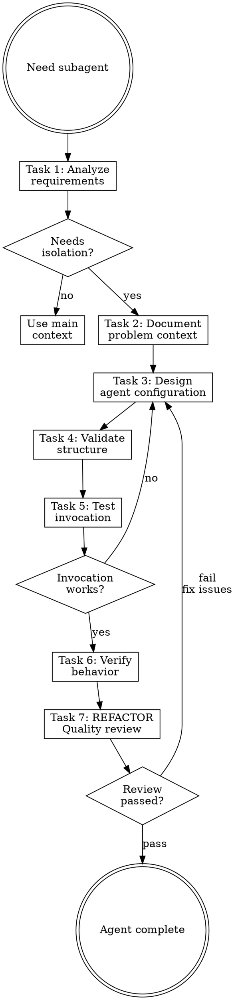

# Writing Subagents

## Overview

**Writing subagents IS creating specialized workers with isolated contexts.**

Subagents run via the Agent tool with their own context window, tools, and system prompt. Use for tasks that benefit from focused expertise.

**Core principle:** One agent, one responsibility. Bloated agents become unfocused.

**Violating the letter of the rules is violating the spirit of the rules.**

## Routing

**Pattern:** Skill Steps
**Handoff:** none
**Next:** none

## Task Initialization (MANDATORY)

Before ANY action, create task list using TaskCreate:

```
TaskCreate for EACH task below:
- Subject: "[writing-subagents] Task N: <action>"
- ActiveForm: "<doing action>"
```

**Tasks:**
1. Analyze requirements
2. Document problem context
3. Design agent configuration
4. Implement agent file
5. Validate structure
6. Test invocation
7. Review and optimize

Announce: "Created 7 tasks. Starting execution..."

**Execution rules:**
1. `TaskUpdate status="in_progress"` BEFORE starting each task
2. `TaskUpdate status="completed"` ONLY after verification passes
3. If task fails → stay in_progress, diagnose, retry
4. NEVER skip to next task until current is completed
5. At end, `TaskList` to confirm all completed

## Agent Configuration Process

| Phase | Focus | What You Do |
|-------|-------|-------------|
| **Requirements** | Understanding | Identify what specialized task needs isolation |
| **Analysis** | Problem definition | Document why main agent isn't sufficient |
| **Design** | Configuration | Plan agent tools, model, and system prompt |
| **Implementation** | Creation | Write agent file with proper configuration |
| **Optimization** | Refinement | Fine-tune tools and prompts for efficiency |

## Task 1: Analyze Requirements

**Goal:** Understand what specialized task needs isolation.

**Questions to answer:**
- What specific task needs a subagent?
- Why can't the main agent do this?
- What tools does this agent need?
- Should it be proactive or manual?

**When to use subagents:**
- Task needs isolated context (code review, deep analysis)
- Task would pollute main conversation
- Task is repetitive and well-defined
- Task benefits from specialized system prompt

See [references/examples.md](references/examples.md) for subagent templates and trigger examples.

**Built-in subagent types (consider BEFORE creating custom agents):**

| Type | Model | Tools | Use Case |
|------|-------|-------|----------|
| `Explore` | Haiku | Read-only (no Write/Edit) | Fast codebase search, analysis |
| `Plan` | Inherit | Read-only | Research and planning |
| `general-purpose` | Inherit | All | Complex multi-step tasks |

**Decision:** Can a built-in type handle this? If yes, use it directly via the Agent tool — no agent file needed.

**Verification:** Can describe the agent's single responsibility in one sentence.

## Task 2: Document Problem Context

**Goal:** Clearly understand why the main agent is insufficient for this task.

**Analysis points:**
1. What specific challenges arise when using the main agent?
2. How would task isolation improve the outcome?
3. What context pollution or focus issues occur?
4. What specialized expertise would help?

**Verification:** Documented specific problems that justify creating a specialized subagent.

## Task 3: Design Agent Configuration

**Goal:** Plan the agent configuration to address the documented problems.

### Agent Location

```
.claude/agents/      # Project-level
~/.claude/agents/    # User-level (global)
```

### Agent Format

```yaml
---
name: agent-name
description: What this agent does. Use proactively when [triggers].
tools: Read, Grep, Glob, Bash
model: sonnet
---

System prompt for the agent.

## Role
[Clear description of the agent's responsibility]

## Process
[Steps the agent should follow]

## Output Format
[Expected output structure]
```

### Configuration & Tools

See [references/agent-spec.md](references/agent-spec.md) for full configuration fields, model selection, context:fork guidelines, and tool permissions.

**Key rules:**
- `name`: lowercase with hyphens, matches filename
- `description`: include 2-4 concrete examples in `<example>` blocks showing triggering conditions
- `model`: use `inherit` unless specific model capabilities needed
- `color`: unique color per agent (blue, green, red, purple, yellow)
- `tools`: minimal set (principle of least privilege). Subagents CANNOT request permissions at runtime.
- Plugin agents do NOT support `hooks`, `mcpServers`, or `permissionMode`

| Agent Type | Recommended Tools |
|------------|-------------------|
| Code reviewer | `Read, Grep, Glob` |
| Test runner | `Read, Bash, Grep` |
| Explorer | `Read, Glob, Grep, Bash` |
| Writer | `Read, Edit, Write` |

See [references/agent-spec.md](references/agent-spec.md) for the three-layer model selection guide, isolation guide, effort guide, and Opus/Haiku constraints.

**Verification:**
- [ ] Name is lowercase with hyphens
- [ ] Description has clear trigger
- [ ] Tools are minimal (principle of least privilege)
- [ ] System prompt is focused

## Task 4: Validate Structure

**Goal:** Verify agent file structure is correct.

**Checklist:**
- [ ] File is in `.claude/agents/` directory
- [ ] Frontmatter has `name` and `description`
- [ ] Name matches filename (minus .md)
- [ ] Tools are appropriate for the task
- [ ] System prompt is actionable
- [ ] No overlapping responsibility with other agents

**Verification:** All checklist items pass.

## Task 5: Test Invocation

**Goal:** Verify agent can be invoked via Agent tool.

**Test:**
```
Agent tool:
- subagent_type: "[plugin:]agent-name"
- prompt: "Test invocation"
```

**Check:**
- Agent loads correctly
- System prompt is applied
- Tool restrictions work
- Model selection honored

**Verification:** Agent invocation succeeds without errors.

## Task 6: Verify Behavior

**Goal:** Run agent on real task and verify quality.

**Process:**
1. Invoke agent with real task input
2. Observe agent follows its system prompt
3. Verify output matches expected format
4. Check agent stays within its scope

**Verification:**
- Agent produces expected output
- Agent uses only granted tools
- Agent doesn't exceed its scope

## Task 7: REFACTOR - Quality Review

**Goal:** Have subagent reviewed by subagent-reviewer.

```
Agent tool:
- subagent_type: "rcc:subagent-reviewer"
- prompt: "Review subagent at [path/to/agent.md]"
```

**Interpret YAML output:**
- `pass: true` → Subagent complete
- `pass: false` → Fix all issues listed, re-run reviewer, repeat until `pass: true`

**This is the REFACTOR phase:** Close loopholes identified by reviewer.

**Verification:** subagent-reviewer returns YAML with `pass: true`.

## Trigger Patterns

- **Proactive:** Include "Use proactively when..." in description for auto-invoke
- **Manual:** Omit proactive triggers for explicit-only invocation

## Red Flags - STOP

These thoughts mean you're rationalizing. STOP and reconsider:

- "This agent needs all tools"
- "One agent can handle multiple responsibilities"
- "Main context is fine, don't need isolation"
- "Skip testing, the prompt is simple"
- "Use opus for everything / use haiku for everything"

**All of these mean: You're about to create a weak agent. Follow the process.**

## Common Rationalizations

| Excuse | Reality |
|--------|---------|
| "Needs all tools" | More tools = more ways to go wrong. Minimize. |
| "Multi-purpose agent" | Jack of all trades = master of none. One job. |
| "Main context works" | Context pollution is invisible until it's a problem. |
| "Simple prompt" | Simple ≠ correct. Test the behavior. |
| "Use opus for everything / use haiku for everything" | Each layer has a role. Start with Sonnet as implementer. Add Haiku orchestration only when dispatch complexity justifies it. Add Opus quality gate only with a revision loop. |

## Flowchart: Subagent Creation


```dot
digraph subagent_creation {
    rankdir=TB;

    start [label="Need subagent", shape=doublecircle];
    analyze [label="Task 1: Analyze\nrequirements", shape=box];
    need_agent [label="Needs\nisolation?", shape=diamond];
    no_agent [label="Use main\ncontext", shape=box];
    baseline [label="Task 2: Document\nproblem context", shape=box];
    write [label="Task 3: Design\nagent configuration", shape=box];
    validate [label="Task 4: Validate\nstructure", shape=box];
    invoke [label="Task 5: Test\ninvocation", shape=box];
    invoke_pass [label="Invocation\nworks?", shape=diamond];
    verify [label="Task 6: Verify\nbehavior", shape=box];
    review [label="Task 7: REFACTOR\nQuality review", shape=box];
    review_pass [label="Review\npassed?", shape=diamond];
    done [label="Agent complete", shape=doublecircle];

    start -> analyze;
    analyze -> need_agent;
    need_agent -> no_agent [label="no"];
    need_agent -> baseline [label="yes"];
    baseline -> write;
    write -> validate;
    validate -> invoke;
    invoke -> invoke_pass;
    invoke_pass -> verify [label="yes"];
    invoke_pass -> write [label="no"];
    verify -> review;
    review -> review_pass;
    review_pass -> done [label="pass"];
    review_pass -> write [label="fail\nfix issues"];
}
```

## References

- [references/examples.md](references/examples.md) - Subagent templates
- [references/tools.md](references/tools.md) - Available tools reference
- See also: `advising-architecture` skill for component classification guidance
